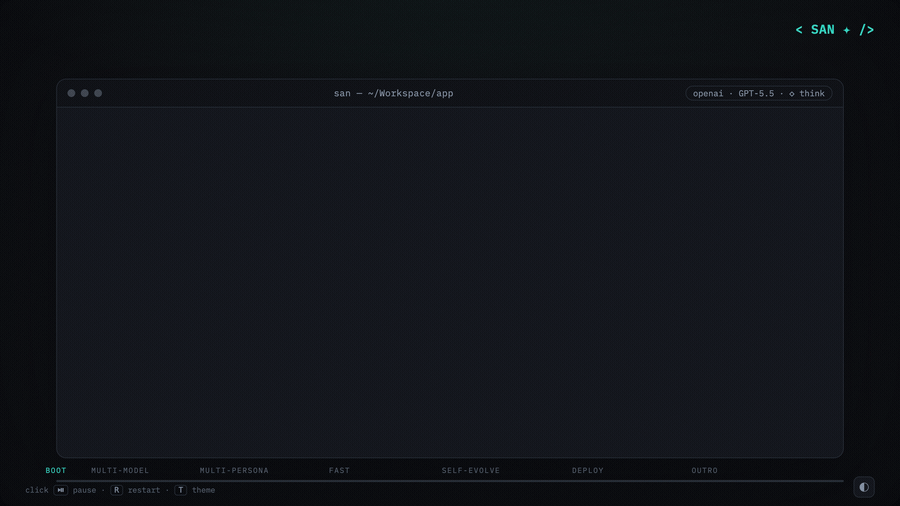

<div align="center">
  <h1>&lt; SAN ✦ /&gt;</h1>
  <p><strong>Minimal overhead. Maximum agent.</strong></p>
  <p>Small context, native speed, open all the way down.</p>
  <p>
    <a href="https://github.com/genai-io/san/releases"></a>
    <a href="https://genai-io.github.io/san/"></a>
    <a href="https://genai-io.github.io/san/getting-started.html"></a>
    <a href="docs/index.md"></a>
    <a href="https://www.producthunt.com/products/san?launch=san"></a>
    <a href="LICENSE"></a>
  </p>
  <p>
    <strong>English</strong> · <a href="README.zh.md">简体中文</a>
  </p>
  <p>
    <a href="https://genai-io.github.io/san/intro.html"></a>
  </p>
  <sub><a href="https://genai-io.github.io/san/intro.html">Open the full-quality intro ↗</a></sub>
  <p>
    ⚡ <strong>~0.01s</strong> cold start&nbsp;&nbsp;·&nbsp;&nbsp;📦 <strong>~12 MB</strong> single binary&nbsp;&nbsp;·&nbsp;&nbsp;🪶 <strong>zero</strong> runtime deps
  </p>
</div>

San is an open-source terminal agent runtime: one native Go binary, no Node.js
or Python. Everything the model touches — prompt, tools, providers, extensions —
stays yours to change.

## Why San

Three properties, and San refuses to trade any one of them for the others.

**Small** — ~2.3k tokens of harness reach the model before your first message; the rest of the context window goes to your work. On disk, one 12 MB binary with zero runtime deps — it drops onto a laptop, a CI runner, or a `scratch` container.

**Fast** — ~0.01s cold start, and a full tool-use task returns in ~3.3s end to end. What you wait on is the model, not the client ([benchmark](#benchmark-san-vs-claude-code)).

**Open** — plug in models, skills, subagents, and MCP servers; write your own system prompt, autopilot goals, and self-learning strategy; replay any run in `san inspector`.

**Minimal overhead, not a minimal agent.**

<sub>*The name — **San**, written **三** ("three") and drawn **☰**. From the Dao De Jing, 三生万物 — "three begets the ten-thousand things": one runtime that becomes any agent, running a three-step loop (reason → act → observe). The command stays `san`.*</sub>

## Open architecture

<details>
<summary><b>Overview diagram</b></summary>

<div align="center">
  
</div>

</details>

**Plug in** — nothing is hardwired. Models from Anthropic, OpenAI, Google, DeepSeek, Ollama, and a dozen more; the web search backend of your choice; extensions of every kind — skills, subagents, MCP servers, plugins, hooks.

**Write** — how the agent behaves is text you own, not something baked into the binary. Compose the system prompt ([how](docs/concepts/harness-channels.md)), bundle it into a persona you can switch, give autopilot a goal, set the strategy self-learning follows.

**Oversee** — nothing runs unwatched. You choose how much San may do without asking, and subagents inherit that choice ([permissions](docs/concepts/permission-model.md)); the inspector replays any run exactly as the model saw it.


## Installation

**macOS / Linux**

```bash
curl -fsSL https://raw.githubusercontent.com/genai-io/san/main/install.sh | bash
```

**Windows (PowerShell)**

```powershell
irm https://raw.githubusercontent.com/genai-io/san/main/install.ps1 | iex
```

Start with `san`. On first launch, choose a model and add its API key when prompted. To update later, run `san update`.

<details>
<summary><b>Other methods</b></summary>

**Uninstall**

```bash
# macOS / Linux
curl -fsSL https://raw.githubusercontent.com/genai-io/san/main/install.sh | bash -s uninstall
```

```powershell
# Windows (PowerShell)
& ([scriptblock]::Create((irm https://raw.githubusercontent.com/genai-io/san/main/install.ps1))) uninstall
```

**Go Install (requires Go 1.25.8+)**

```bash
go install github.com/genai-io/san/cmd/san@latest
```

**Build from Source**

```bash
git clone https://github.com/genai-io/san.git
cd san
go build -o san ./cmd/san
mkdir -p ~/.local/bin && mv san ~/.local/bin/
```

</details>

## Usage

```bash
san                          # interactive
san "explain this function"  # one-shot
san -p "do something"        # print mode (no TUI), pipe-friendly
san --continue               # resume the latest session
san --resume                 # pick a past session to resume
```

Subcommands: `inspector` · `agent` · `plugin` · `mcp` — run `san <command> --help` for each.

| What | How |
|---|---|
| Model · thinking budget | `/models` · `Ctrl+T` |
| Permission mode | `Shift+Tab` (ask · auto-accept · autopilot) |
| Long-running work · learning | `/autopilot` · `/goal` · `/evolve` |
| All slash commands | `/help` |
| Keys | `Enter` send · `Alt+Enter` newline · `Esc` stop · `Ctrl+O` expand tool · `Ctrl+C` cancel · `Ctrl+D` exit |

[`docs/guides/getting-started.md`](docs/guides/getting-started.md)

### Configuration

<details>
<summary><b>Credentials</b></summary>

| Service | Variable |
|:--------|:---------|
| **Anthropic** (Claude) | `ANTHROPIC_API_KEY` or [Vertex AI](https://cloud.google.com/vertex-ai/generative-ai/docs/partner-models/claude) |
| **OpenAI** (GPT, o-series, Codex) | `OPENAI_API_KEY`, or a ChatGPT subscription (sign in via `/models`) |
| **GitHub Copilot** (all Copilot models) | a Copilot subscription (sign in via `/models`) |
| **Google** (Gemini) | `GOOGLE_API_KEY` |
| **DeepSeek** (DeepSeek V4) | `DEEPSEEK_API_KEY` |
| **Moonshot** (Kimi) | `MOONSHOT_API_KEY` |
| **Alibaba** (Qwen) | `DASHSCOPE_API_KEY` |
| **MiniMax** | `MINIMAX_API_KEY` |
| **Z.ai** (GLM / GLM Coding Plan) | `BIGMODEL_API_KEY` |
| **SenseNova** | `SENSENOVA_API_KEY` |
| **Mimo** | `MIMO_API_KEY` |
| **Volcengine** (Ark) | `VOLCENGINE_API_KEY` |
| **Ollama** (local) | `OLLAMA_BASE_URL` (default `http://localhost:11434/v1`) |
| **Agnes-AI** | `AGNESAI_API_KEY` |
| **Exa** search | _none_ (default) |
| **Tavily** search | `TAVILY_API_KEY` |
| **Brave** search | `BRAVE_API_KEY` |
| **Serper** search | `SERPER_API_KEY` |

</details>

<details>
<summary><b>Config files &amp; layout</b></summary>

Settings load from `~/.san/` and `<project>/.san/`, with project settings overriding user settings. Project instructions are read from `.san/SAN.md`, `SAN.md`, `.claude/CLAUDE.md`, or `CLAUDE.md`, in that order.

User-level (`~/.san/`):

```
providers.json    # Provider connections and current model
settings.json     # Permissions, hooks, env, active persona
skills.json       # Skill states
personas/         # Persona bundles: system prompt parts, skills, settings
skills/           # Custom skill definitions
agents/           # Agent definitions
commands/         # Custom slash commands
plugins/          # Installed plugins
projects/         # Session transcripts + indexes
```

Project-level (`.san/`):

```
settings.json       # Permissions, hooks, disabled tools
mcp.json            # MCP server definitions (team shared)
mcp.local.json      # MCP server definitions (personal, git-ignored)
personas/           # Project-scoped persona bundles (override user-level)
agents/*.md         # Subagent definitions
skills/*/SKILL.md   # Skills
commands/*.md       # Slash commands
plugins/            # Project-level plugins
plugins-local/      # Local plugins (git-ignored)
```

</details>

## Benchmark: San vs Claude Code

Compared with [Claude Code](https://claude.ai/code) v2.1.112 on Apple Silicon, same model (`claude-sonnet-4-6`):

| Metric | San | Claude Code | Advantage |
|--------|---------|-------------|-----------|
| Download size | 12 MB | 63 MB (+ Node.js 112 MB) | **5x smaller** |
| Disk footprint | 38 MB | 175 MB | **4.6x smaller** |
| Startup time | ~0.01s | ~0.20s | **20x faster** |
| Startup memory | ~32 MB | ~189 MB | **5.8x less** |
| Simple task | ~2.4s / 39 MB | ~10.4s / 286 MB | **4.3x faster, 7.3x less memory** |
| Tool-use task | ~3.3s / 39 MB | ~26.0s / 285 MB | **7.9x faster, 7.2x less memory** |
| Harness context* | ~2.3k tokens | ~20.9k tokens | **~9x leaner** |

<sub>*Context overhead is system prompt + tool schemas on an empty first turn, measured separately on San v1.22.0 vs Claude Code v2.1.220 — see [method](docs/operations/benchmark.md#7-context-overhead-first-turn). All other rows are from the v1.13.2 / v2.1.112 run.</sub>

Comparable feature sets — the gap is client-side overhead, not capability. [`docs/operations/benchmark.md`](docs/operations/benchmark.md)

## Documentation

- [Documentation Index](docs/index.md) — map of architecture, features, operations, and references
- [Architecture](docs/concepts/architecture.md) — architecture entrypoint and reading order
- [Package Map](docs/reference/package-map.md) — package ownership and dependency boundaries
- [Personas](docs/concepts/persona.md) — bundled system prompt, skills, agents, and settings
- [System Prompt](docs/concepts/harness-channels.md) — Slot model, persona, skill/agent injection
- [Subagents](docs/packages/2-feature/subagent.md) · [Skills](docs/packages/2-feature/skill.md) · [Plugins](docs/packages/2-feature/plugin.md) · [MCP](docs/packages/2-feature/mcp.md)
- [Hooks](docs/packages/2-feature/hook.md) · [Permissions](docs/concepts/permission-model.md) · [Tasks](docs/packages/2-feature/task.md)
- [Inspector](docs/packages/2-feature/inspector.md) — local web UI for transcript replay and debugging
- Per-package design under [`docs/packages/`](docs/packages/) — start at [Package Index](docs/packages/index.md)

## Related Projects

- [Claude Code](https://claude.ai/code) — Anthropic's AI coding assistant
- [Aider](https://github.com/paul-gauthier/aider) — AI pair programming in terminal
- [Continue](https://github.com/continuedev/continue) — Open-source AI code assistant

## Community

Two ways in — WeChat for the Chinese community, Slack for everyone else:

<div align="center">
<table>
<tr>
<td align="center" width="50%">
  <br>
  <sub>关注公众号「极客外传」· 回复 <code>san</code> 或 <code>三</code> 入群</sub>
</td>
<td align="center" width="50%">
  <br>
  <sub>Scan or <a href="https://join.slack.com/t/sanaico/shared_invite/zt-3zvfr8v6f-dchFpvpufY7fKA7tG7lhIg">join our Slack</a></sub>
</td>
</tr>
</table>
</div>

## Contributing

Contributions welcome! See [CONTRIBUTING.md](CONTRIBUTING.md) for guidelines.

## License

Apache License 2.0 - see [LICENSE](LICENSE) for details.
