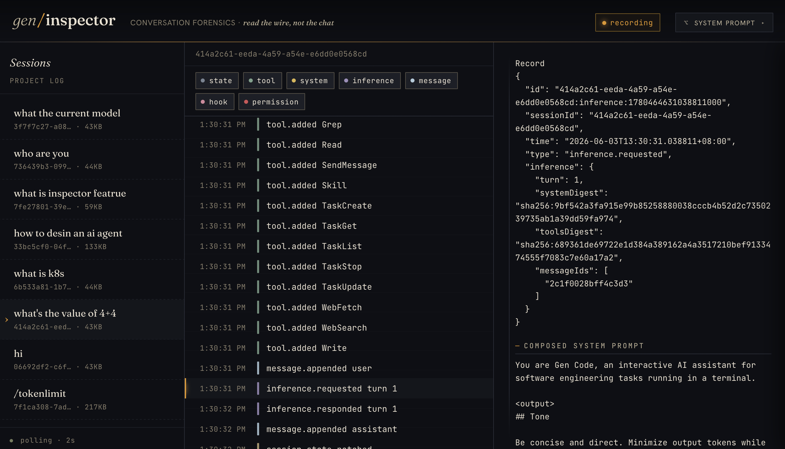

# Inspector（会话检查器）

**Inspector** 是一个本地 Web UI，用于浏览和调试 gen code 的会话转录。它读取
`~/.gen/projects/` 下存储的 JSONL 转录文件，将每个事件 —— 用户消息、模型响应、
工具调用、系统事件和 harness 状态 —— 展示为可检查的时间线。可以把它理解为
针对 agent 运行的"对话取证"工具。



## 快速开始

```bash
gen inspector
```

此命令会在 localhost 上启动一个 Web 服务器（随机端口），并在默认浏览器中打开
inspector 页面。按 `Ctrl-C` 即可停止。

```bash
# 指定端口
gen inspector --addr 127.0.0.1:38080

# 只打印 URL，不自动打开浏览器
gen inspector --no-open
```

> **安全提示：** Inspector 仅绑定到 loopback 地址
> （`127.0.0.1`、`::1`、`localhost`）。转录中包含模型看到的所有内容，包括
> 工具输入中的密钥 —— 绑定到非 loopback 地址会被拒绝。

## 功能

### 浏览会话

左侧边栏列出当前项目目录下的所有历史会话。点击任意会话即可加载其转录。

### 时间线导航

中间面板以时间线形式按时间顺序展示转录中的每条记录。每条记录都带有事件类型标签：

- **用户消息** —— 用户输入或通过管道传入的文本
- **模型响应** —— LLM 输出的文本和 thinking 内容
- **工具调用** —— 模型发起的函数调用（参数和结果）
- **系统事件** —— 会话开始、上下文压缩、错误
- **Harness 状态** —— 系统 prompt 段、工具 schema、权限决策

顶部的筛选芯片可以显示或隐藏特定事件类型，方便聚焦关注的内容。

### 查看原始记录

点击任意记录，即可在右侧详情面板中查看其原始 JSON。这就是写入磁盘的 JSONL
行原文 —— 无转换、无隐藏字段。

### 检查系统 Prompt

在任意记录处，可以打开**系统 Prompt 浮层**，查看该时刻的完整系统 prompt。
包括 harness 注入的所有段：人设（persona）、技能、项目记忆
（`GEN.md` / `CLAUDE.md`）、工具 schema 以及 MCP server prompt。

### 状态回放

**State** 标签页可以重建转录中任意时间点的模型完整上下文：
- **系统 prompt** —— 包含所有注入段的完整文本
- **工具 schema** —— 每个可用工具的 JSON Schema 定义
- **活跃消息链** —— 当前上下文中确切的消息序列（遵循压缩边界和
  system-reminder 注入规则）

### 完整性校验

在每次推理请求（`inference.requested`）处，inspector 会重新计算回放状态的
摘要，并与记录值进行比对：
- **系统 prompt 摘要** —— 组装后的系统 prompt 的 SHA-256
- **工具摘要** —— 序列化工具 schema 的 SHA-256
- **消息 ID** —— 有序的消息标识符列表

不匹配的情况会以 **BAD** 徽标标记，精确显示哪些消息缺失或多余。这对于调试
压缩 bug、harness 注入问题或意外的状态漂移非常有用。

### 实时追踪

当你另一个终端中有活跃的 gen code 会话时，inspector 可以通过 Server-Sent
Events（SSE）实时追踪新记录。打开会话并打开 **Live** 开关 —— 新记录会在
写入磁盘时实时出现在时间线中。

## UI 布局

| 区域 | 显示内容 |
|------|---------|
| **侧边栏**（左） | 会话列表：按日期排序的项目会话 |
| **时间线**（中） | 带筛选芯片的事件记录流 |
| **详情**（右） | 选中记录的原始 JSON |
| **系统 Prompt 浮层** | 当前时间点的完整系统 prompt |
| **State 标签页** | 重建的上下文：系统 prompt + 工具 + 消息 |

## 工作原理

1. `gen inspector` 启动一个绑定到 loopback 的 HTTP 服务器。
2. 服务器从 `~/.gen/projects/<encoded-cwd>/transcripts/` 读取转录 JSONL 文件。
3. 嵌入式 SPA（单页应用）通过 REST API 获取会话列表和记录，通过 SSE 订阅实时更新。
4. **回放引擎**（`replay.go`）从头遍历事件日志，重建任意记录索引处的模型完整上下文。
   结果缓存在 LRU 中（容量 64），保证时间线拖拽的流畅性。
5. 所有处理均为只读 —— 磁盘上的转录文件不会被修改。

## API 端点

Inspector 的 HTTP API 为自带 UI 设计，但你也可以直接调用用于脚本处理：

| 方法 | 路径 | 说明 |
|------|------|------|
| `GET` | `/` | Inspector SPA 页面 |
| `GET` | `/api/sessions` | 列出项目的所有会话 |
| `GET` | `/api/sessions/{id}/records?after=N` | 转录记录（NDJSON 格式），支持分页 |
| `GET` | `/api/sessions/{id}/stream` | SSE 实时追踪新记录 |
| `GET` | `/api/sessions/{id}/state/{recordID}` | 指定记录处的回放状态 |

## 命令行参数

| 参数 | 默认值 | 说明 |
|------|--------|------|
| `--addr` | `127.0.0.1:0` | 绑定地址（仅限 loopback；默认随机端口） |
| `--no-open` | `false` | 只打印 URL，不自动打开浏览器 |

## 参见

- [包设计文档](../packages/inspector.md) —— 内部实现与接口约定
- [会话转录](../packages/session.md) —— 磁盘上的 JSONL 格式
- [上下文压缩](../concepts/compaction.md) —— 上下文窗口压缩如何与转录回放交互
