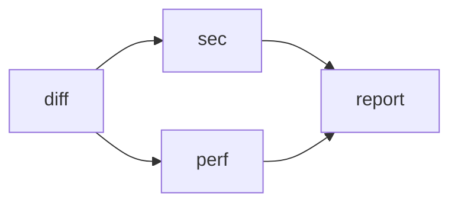
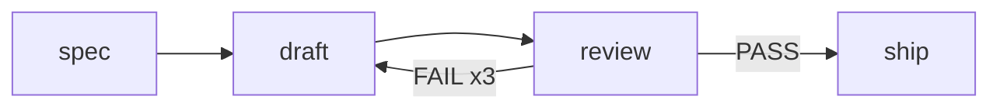

# Workflow

A workflow is several subagent turns arranged as a graph: which runs after
which, which run together, which run only on a given answer. It is one
markdown document, and there are two ways in — a file you saved under
`.san/workflows/`, or a document the model writes on the spot. Either way
San validates the whole thing before asking for approval, runs it as one
background task, and delivers one summary when it finishes.

The `Workflow` tool ships **disabled**: enable it from `/tools`. Until then the
model does not see it, and `/workflow` says how to turn it on.

Use a workflow when the arrangement matters more than any single job — a
dependency order a long turn could forget, or a fan-out whose intermediate
results should stay out of the main conversation. For one bounded job, or a
one-off fan-out, the `Agent` tool is still the right call.

## The definition

````markdown
---
name: review
max_parallel: 4
---



## diff
mode: explore

Summarize {{input.base}}..HEAD by package

## sec
mode: explore

Security only: {{diff}}

## perf
mode: explore

Performance regressions only: {{diff}}

## report
Merge into one review: {{sec}} {{perf}}
````

| Part | Rule |
| --- | --- |
| frontmatter | optional: `name`, `description`, `max_parallel` (default 4) |
| mermaid block | the only source of topology. Starts with `flowchart LR`; then bare ids joined by `-->` (sequence), `&` (fan-out and fan-in), `-->\|LABEL\|` (conditional) and `-->\|LABEL xN\|` pointing back at an ancestor (a bounded retry; see below). Node shapes, subgraphs and other mermaid syntax are errors, not silently ignored — a dropped edge is a silently wrong graph. |
| `## id` | one node, one subagent turn. Every id in the graph needs a section and vice versa. |
| `key: value` under the heading | the contiguous run of such lines is config: `agent`, `mode` (`explore`, `edit`, `default`), `model`, `continue_on_error`. Everything after them is the prompt. An unknown key is an error; put a blank line before prompt text that happens to start with `word:`. |
| `agent:` | the name of a definition in `.san/agents/`, which is where a node gets its tool list, skills, system prompt and MCP servers. A name that resolves to nothing is refused before approval — in a file, an unknown name is a typo, not a label. Leave the line out for the default agent. |
| `{{id}}` | the output of a node upstream of this one. Any ancestor on a taken path counts, not only the direct parent. Referencing a node with no path here is a validation error. |
| `{{input.key}}` | a value passed in the tool's `inputs`. |
| `for_each` + `max_workers` | fans this node out over a plan; see below. |

Every node is a fresh subagent with no memory of the others; brief each one
fully, the way an `Agent` prompt is briefed.

## Saved workflows

Definitions live in `.san/workflows/*.md` (project) and
`~/.san/workflows/*.md` (user); the project copy wins when both define the
same name, and the `name:` in frontmatter beats the filename. The `Workflow`
tool lists what it finds in its own description, so the model can run one by
`name` instead of rewriting it; `/workflow` with no argument lists them, and
`/workflow <name> key=value` runs one.

A file is parsed when it is run, not at startup: a broken definition is
reported to whoever tried to run it, and never blocks the session.

## Fanning out over a plan

A node with `for_each` runs once per item of a plan an upstream node
produced, which is how one workflow splits work it could not know in advance:

````markdown
## plan
Split the review into non-overlapping tasks, at most 8, as JSON:
{"tasks":[{"name":"llm","prompt":"Review error handling in internal/llm"}]}

## review
for_each: plan.tasks
max_workers: 8
agent: Explore
mode: explore

{{item.prompt}}

## merge
Merge: {{review}}
````

- `for_each: plan.tasks` reads the first JSON value in `plan`'s output and
  takes its `tasks` field; `for_each: plan` uses the whole value. It must be
  a non-empty array.
- Items may be strings (`{{item}}`) or objects (`{{item.key}}`, and
  `{{item}}` for the whole object). An item's `name` field labels its
  worker; without one the label is its position.
- **`max_workers` is required.** A plan with more items than that is refused
  rather than truncated — so say the same limit in the planning node's
  prompt. This is what makes the worst case knowable before launch, which is
  the only reason dynamic fan-out is allowed at all.
- The two bounds do different jobs: `max_workers` caps how many workers a
  plan may *ask for* (a larger plan is refused), while `max_parallel` caps
  how many turns are *in flight* across the whole run. Workers queue for the
  run's slots like any other node.
- Downstream sees the workers' outputs merged under `## <label>` headings.
  A worker that failed is left out rather than left as an empty heading.
- The orchestrator returns a plan; it does not call the workers. They are
  ordinary nodes, each through the same permission gate with its own
  transcript, so nothing recurses.

The approval dialog states the bound it buys: `up to 14 subagent turns` and
`review: up to 8 workers over plan.tasks`.

## Drafting until a review passes

A conditional edge pointing back at an ancestor is a retry, and it must say
how many:

````markdown


## draft
Write it. Previous review: {{review}}

Spec: {{spec}}

## review
PASS or FAIL: {{draft}}

## ship
Ship {{draft}}
````

Parsing unrolls this into a plain chain — `draft#1 → review#1 ─FAIL→ draft#2
→ …`, with a `PASS` escape from every round to `ship` — so the scheduler,
the permission gate and the summary never learn that a loop existed. What
follows falls out of that:

| Case | Behaviour |
| --- | --- |
| `{{review}}` inside `draft` | the previous round's review; empty on the first |
| `{{draft}}` inside `ship` | the round that actually passed |
| an early round passing | the remaining rounds are omitted, never run |
| every round used up, still `FAIL` | the workflow **fails** — the condition was never met, and a result that failed review must not flow on |
| `review` answering neither `FAIL` nor `PASS` | that round **fails**, in any round. The node carrying the back edge is the one place every answer is declared (the retry label plus the escapes), so an answer outside them is a model gone off-script, not a quiet stop. Any other node — a gate outside the loop or inside its body — keeps gate semantics: an unmatched `NO` means "stop here" and succeeds |
| the bound | required, from `x1` to `x10`. A back edge without `xN` is the cycle error it would otherwise be. The cap is checked before anything is unrolled, since unrolling happens while the approval dialog is being built |
| one loop after another | the second is always entered at its first round, however many rounds the first one took |
| the target | must be an ancestor of the source, or there is no loop to bound |
| a node in two loops, or `for_each` inside one | rejected: rounds × rounds and dynamic × iteration are both cartesian explosions |
| an edge into the body from outside | rejected — route it through the loop's head, or a later round would re-read a node that ran once |

The point of splitting `draft` from `review` is that the review runs in a
clean context instead of grading what it just wrote. The approval dialog
counts every round in its worst case, and names the loop: `draft/review: up
to 3 rounds`.

## How it runs

- A node starts once every upstream has settled. At most `max_parallel`
  nodes run at once.
- `a -->|HIGH| b` runs `b` only when `a`'s trimmed output equals `HIGH`. A
  node whose upstream edges were all untaken (or whose upstreams were all
  omitted themselves) is **omitted**; it never runs, and a `{{id}}` pointing
  at it renders empty. One taken edge is enough to run.
- A node sees the outputs of the ancestors reached through taken edges. An
  untaken conditional edge hides that branch: in `a -->|X| d`, `{{a}}`
  inside `d` is `a`'s output only when `a` said `X`.
- A failed node **skips** everything downstream and fails the workflow.
  `continue_on_error: true` on the failing node lets downstream run and
  keeps the workflow's verdict clean. What `{{id}}` then renders to depends
  on whether anything whole survived: nothing for an ordinary node, since
  its content is the half-answer it stopped on and a downstream node would
  read that as the finished thing; for a `for_each` node, the workers that
  did finish — their output is complete, there is simply less of it than the
  plan asked for.
- A node fails when its turn ends any way other than the model stopping on
  its own — step cap, truncation, refusal, cancellation, error. A model that
  stops early having done half the job reports success; a converging node
  that reviews its inputs is the guard for that.
- Every node passes the same permission gate as a background `Agent`: a
  prompt for confirmation collapses to a deny, and a definition cannot ask
  for `bypass` — `mode` accepts `explore`, `edit` and `default` only, so a
  file in the project directory is trusted no further than any other file
  there. What `default` resolves to is the subagent layer's business, the
  same as for `Agent`.
- `AgentStop` on the workflow's task cancels it: nodes that have not started
  fail, running nodes are interrupted, finished outputs are kept.
- The `Workflow` tool is parent-only, like `Agent`: a subagent cannot start
  one.

## What comes back

The tool returns immediately with the task id. When the run settles, the
task's completion notification carries the summary — one status line per
node, then the output of every sink (a node with nothing downstream). On
failure the notification names the failed and skipped nodes; the full
summary stays in the task output. Each node's transcript is saved under the
session like any subagent's.

```
workflow review succeeded in 1m24s
  ✓ diff (12s)
  ✓ sec (41s)
  ✓ perf (38s)
  ✓ report (27s)

## report
…
```

## Not yet

A graph view in the panel is the last phase of
[`design/proposals/0001-workflow-orchestration.md`](../design/proposals/0001-workflow-orchestration.md),
and only if the run's progress lines prove insufficient. An unbounded cycle
stays rejected: cost, progress and convergence are all undecidable without a
bound.
