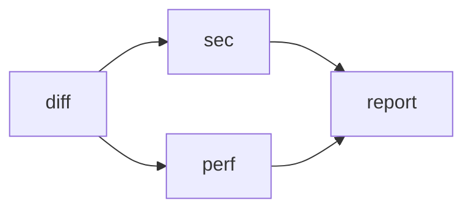
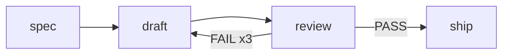

# Workflow

A workflow is several subagent turns arranged as a graph: which runs after
which, which run together, which run only on a given answer. It is one
markdown document, and there are two ways in — a file you saved under
`.san/workflows/`, or a document the model writes on the spot. Either way
San validates the whole thing before anything runs, runs it as one
background task, and delivers one summary when it finishes.

The `Workflow` tool ships **disabled**: enable it from `/tools` to let the
model start workflows on its own. Your saved workflows run with `/workflow`
either way.

Use a workflow when the arrangement matters more than any single job — a
dependency order a long turn could forget, or a fan-out whose intermediate
results should stay out of the main conversation. For one bounded job, or a
one-off fan-out, the `Agent` tool is still the right call.

## The definition

````markdown
---
name: review
max_parallel: 4
---


```mermaid
flowchart LR
  diff --> sec & perf --> report
```

## diff
mode: explore

Summarize {{input.base}}..HEAD by package

## sec
mode: explore

Security only: {{diff}}

## perf
mode: explore

Performance regressions only: {{diff}}

## report
Merge into one review: {{sec}} {{perf}}
````

| Part | Rule |
| --- | --- |
| frontmatter | optional: `name`, `description`, `max_parallel` (default 4) |
| mermaid block | the only source of topology. Starts with `flowchart LR`; then bare ids joined by `-->` (sequence), `&` (fan-out and fan-in), `-->\|LABEL\|` (conditional) and `-->\|LABEL xN\|` pointing back at an ancestor (a bounded retry; see below). Node shapes, subgraphs and other mermaid syntax are errors, not silently ignored — a dropped edge is a silently wrong graph. |
| `## id` | one node, one subagent turn. Every id in the graph needs a section and vice versa. |
| `key: value` under the heading | the contiguous run of such lines is config: `agent`, `mode` (`explore`, `edit`, `default`), `model`, `continue_on_error`. Everything after them is the prompt. An unknown key is an error; put a blank line before prompt text that happens to start with `word:`. |
| `agent:` | the name of a definition in `.san/agents/`, which is where a node gets its tool list, skills, system prompt and MCP servers. A name that resolves to nothing is refused before the run starts — in a file, an unknown name is a typo, not a label. Leave the line out for the default agent. |
| `{{id}}` | the output of a node upstream of this one. Any ancestor on a taken path counts, not only the direct parent. Referencing a node with no path here is a validation error. |
| `{{input.key}}` | a value passed in the tool's `inputs`. |
| `for_each` + `max_workers` | fans this node out over a plan; see below. |

Every node is a fresh subagent with no memory of the others; brief each one
fully, the way an `Agent` prompt is briefed.

## Saved workflows

Definitions live in `.san/workflows/*.md` (project) and
`~/.san/workflows/*.md` (user); the project copy wins when both define the
same name, and the `name:` in frontmatter beats the filename. The `Workflow`
tool lists what it finds in its own description, so the model can run one by
`name` instead of rewriting it. The input box suggests subcommands after
`/workflow ` and saved names after `/workflow show ` or `/workflow run `:

| Command | Result |
| --- | --- |
| `/workflow list` | List saved definitions (`/workflow` also works). |
| `/workflow show <name>` | Preview the compact dependency graph without starting a task. |
| `/workflow run <name> [key=value …]` | Run it directly; the notice gives the task ID and the task area shows grouped activity above one status graph. |
| `/workflow stop [task-id]` | Stop the sole running workflow, or name a task ID when several run at once. |

`/workflow <name> [key=value …]` remains a shortcut for existing users.
The preview labels itself as a preview, pairs graph node names with the first
line of each step's prompt, shows referenced input keys, and prints a
ready-to-fill `/workflow run` command. When typing that command,
Tab completes saved names and input keys such as `topic=`. A direct run
reports a missing referenced input before starting. San launches it without
a model turn. Quote an input value that contains spaces, for example
`/workflow run demo topic="HTTP caching"`. Quote a saved name containing spaces
too: `/workflow run "release review" base=main`. Previews and name suggestions
add those quotes automatically. Input-key completion treats a quoted value as
one argument, including while its closing quote is still being typed.

The preview and live view draw a small branch-and-join graph for parallel
stages. Other simple stages use one line; graphs with more complex edges show
an exact dependency list. During a run, the task area (Alt+T) groups the
latest eight events in bordered blocks by node or `for_each` worker. Long calls
wrap to about 90% of the current window width and reflow on resize. The
single status graph sits below the activity. Its running mark keeps the
original `●/◉` pulse. Running Activity calls use a `| / - \` line spinner.
The workflow's separate Background row is hidden while this view is visible.
The full event trail remains in the task log. The launch notice includes
`/workflow stop <task-id>`; `/workflow stop` also works when only one workflow
is running. Stop executes immediately even while the main agent is streaming;
the scheduler does not start more nodes after cancellation. If an assistant
message is still streaming, the stop notice waits until that message releases
the conversation tail, so later text and tool-call details continue to arrive.
With an empty input and no foreground response, Ctrl+C stops the sole running
workflow. If several workflows are running, it shows their task IDs so you can
choose one with `/workflow stop <task-id>`. While the main agent is responding,
Ctrl+C interrupts that foreground response first. With no running workflow,
the existing double Ctrl+C shortcut exits San.

A file is parsed when it is run, not at startup: a broken definition is
reported to whoever tried to run it, and never blocks the session.

### Try a full repository audit

[`examples/workflows/ponytail-audit.md`](../../examples/workflows/ponytail-audit.md)
preserves the original `ponytail-audit` instructions in a read-only workflow.
It keeps all six check categories, the evidence rules, the report format and
its example. The instructions are split into six subagent turns:

- `inspect_repo`: establish the scope, assumed load, entry points and main
  data flows; hand off source evidence, tests and unread areas.
- `check_bugs_tests`: check bugs and risky logic without a useful test.
- `check_security_scale`: check security, data loss and failures at the
  expected load.
- `check_speed_bloat`: check real slowness and code to delete, reuse, replace
  with native features, merge or split.
- `verify_findings`: re-read evidence, confirm concrete triggers, search all
  references before declaring code unused, deduplicate and rank findings.
- `write_report`: write the full report in the original simple-English format,
  including the three groups, continuous numbering, four parts per finding,
  verdict, lean totals and unexamined areas.

The three checks run in parallel after `inspect_repo`. Verification waits
for all three, then hands accepted findings to `write_report`. Every node
runs in `explore` mode and changes no code.

Six nodes do not mean six full repository scans. The first node surveys the
repository and passes focused source evidence to the three checks. They reuse
that evidence and read more where needed. Verification checks candidate
findings, including whole-tree reference searches for unused code. The final
node is instructed to write from the supplied results without reading files
or running tools. These are prompt instructions, not enforced read limits.
Nodes have separate conversations and receive upstream output text, not its
full tool history, so overlapping reads remain possible. The original skill
keeps its work in one agent context and can also re-read files to verify a
finding; it does not promise exactly one scan.

This example demonstrates parallel review, evidence handoff and verification.
It is not the cheapest way to audit a repository, and parallel execution does
not guarantee a speedup. For a quick first run, scope it to a small package.
A review of changed files, split into non-overlapping file groups, is a more
bounded demonstration of distributing work; this audit deliberately keeps
the original whole-repository checks.

To install the self-contained example:

```bash
mkdir -p .san/workflows
cp examples/workflows/ponytail-audit.md .san/workflows/ponytail-audit.md
```

In the TUI, use `/workflow show ponytail-audit` to inspect the structure,
then `/workflow run ponytail-audit scope=.` for the whole repository, or
`scope=internal/workflow` for one package. The task view names each stage by
its job, so concurrent checks and the separate verification step are visible.
The task log keeps their full tool activity. The example embeds its prompts;
installing a separate Ponytail skill is not required.

## Fanning out over a plan

A node with `for_each` runs once per item of a plan an upstream node
produced, which is how one workflow splits work it could not know in advance:

````markdown
## plan
Split the review into non-overlapping tasks, at most 8, as JSON:
{"tasks":[{"name":"llm","prompt":"Review error handling in internal/llm"}]}

## review
for_each: plan.tasks
max_workers: 8
agent: Explore
mode: explore

{{item.prompt}}

## merge
Merge: {{review}}
````

- `for_each: plan.tasks` reads the first JSON value in `plan`'s output and
  takes its `tasks` field; `for_each: plan` uses the whole value. It must be
  a non-empty array.
- Items may be strings (`{{item}}`) or objects (`{{item.key}}`, and
  `{{item}}` for the whole object). An item's `name` field labels its
  worker; without one the label is its position.
- **`max_workers` is required.** A plan with more items than that is refused
  rather than truncated — so say the same limit in the planning node's
  prompt. This is what makes the worst case knowable before launch, which is
  the only reason dynamic fan-out is allowed at all.
- The two bounds do different jobs: `max_workers` caps how many workers a
  plan may *ask for* (a larger plan is refused), while `max_parallel` caps
  how many turns are *in flight* across the whole run. Workers queue for the
  run's slots like any other node.
- Downstream sees the workers' outputs merged under `## <label>` headings.
  A worker that failed is left out rather than left as an empty heading.
- The orchestrator returns a plan; it does not call the workers. They are
  ordinary nodes, each through the same permission gate with its own
  transcript, so nothing recurses.

The approval dialog states the bound it buys: `up to 14 subagent turns` and
`review: up to 8 workers over plan.tasks`.

## Drafting until a review passes

A conditional edge pointing back at an ancestor is a retry, and it must say
how many:

````markdown

```mermaid
flowchart LR
  spec --> draft --> review
  review -->|FAIL x3| draft
  review -->|PASS| ship
```

## draft
Write it. Previous review: {{review}}

Spec: {{spec}}

## review
PASS or FAIL: {{draft}}

## ship
Ship {{draft}}
````

Parsing unrolls this into a plain chain — `draft#1 → review#1 ─FAIL→ draft#2
→ …`, with a `PASS` escape from every round to `ship` — so the scheduler,
the permission gate and the summary never learn that a loop existed. What
follows falls out of that:

| Case | Behaviour |
| --- | --- |
| `{{review}}` inside `draft` | the previous round's review; empty on the first |
| `{{draft}}` inside `ship` | the round that actually passed |
| an early round passing | the remaining rounds are omitted, never run |
| every round used up, still `FAIL` | the workflow **fails** — the condition was never met, and a result that failed review must not flow on |
| `review` answering neither `FAIL` nor `PASS` | that round **fails**, in any round. The node carrying the back edge is the one place every answer is declared (the retry label plus the escapes), so an answer outside them is a model gone off-script, not a quiet stop. Any other node — a gate outside the loop or inside its body — keeps gate semantics: an unmatched `NO` means "stop here" and succeeds |
| the bound | required, from `x1` to `x10`. A back edge without `xN` is the cycle error it would otherwise be. The cap is checked before anything is unrolled, since unrolling happens while the approval dialog is being built |
| one loop after another | the second is always entered at its first round, however many rounds the first one took |
| the target | must be an ancestor of the source, or there is no loop to bound |
| a node in two loops, or `for_each` inside one | rejected: rounds × rounds and dynamic × iteration are both cartesian explosions |
| an edge into the body from outside | rejected — route it through the loop's head, or a later round would re-read a node that ran once |

The point of splitting `draft` from `review` is that the review runs in a
clean context instead of grading what it just wrote. The approval dialog
counts every round in its worst case, and names the loop: `draft/review: up
to 3 rounds`.

## How it runs

While a workflow runs, the task area above the input shows a rolling activity
trail grouped by node, then one small status graph. The preview has no status
symbols; the live graph marks waiting (`○`), running (`●/◉` pulse), succeeded
(`✓`), failed (`✗`), skipped (`↷`), and omitted (`⊘`) nodes. A `for_each`
worker gets its own activity block. Model, mode, tool calls, and streamed
model text appear as they arrive. Activity calls rotate a teal `| / - \`
while running, then hold a green `✓` or red `✗` when finished. Their bounded
result preview appears indented below the same call, matched by tool ID even
when several calls finish out of order.
Animation changes only the call's status marker; command and result text stay
unchanged. If a model request fails and retries, its partial text disappears
from Activity. Accepted text and other nodes' output stay visible.
Repeated token-usage lines stay in the task log so the newest eight visible
events focus on work and outcomes. The full trail remains in the task log. The
launch notice gives the task ID and stop command. `Alt+T` hides or shows the
task area. Conditional and retry graphs use a dependency list when a compact
branch view would hide their topology.

- A node starts once every upstream has settled. At most `max_parallel`
  nodes run at once.
- `a -->|HIGH| b` runs `b` only when `a`'s trimmed output equals `HIGH`. A
  node whose upstream edges were all untaken (or whose upstreams were all
  omitted themselves) is **omitted**; it never runs, and a `{{id}}` pointing
  at it renders empty. One taken edge is enough to run.
- A node sees the outputs of the ancestors reached through taken edges. An
  untaken conditional edge hides that branch: in `a -->|X| d`, `{{a}}`
  inside `d` is `a`'s output only when `a` said `X`.
- A failed node **skips** everything downstream and fails the workflow.
  `continue_on_error: true` on the failing node lets downstream run and
  keeps the workflow's verdict clean. What `{{id}}` then renders to depends
  on whether anything whole survived: nothing for an ordinary node, since
  its content is the half-answer it stopped on and a downstream node would
  read that as the finished thing; for a `for_each` node, the workers that
  did finish — their output is complete, there is simply less of it than the
  plan asked for.
- A node fails when its turn ends any way other than the model stopping on
  its own — step cap, truncation, refusal, cancellation, error. A model that
  stops early having done half the job reports success; a converging node
  that reviews its inputs is the guard for that.
- Every node passes the same permission gate as a background `Agent`: a
  prompt for confirmation collapses to a deny, and a definition cannot ask
  for `bypass` — `mode` accepts `explore`, `edit` and `default` only, so a
  file in the project directory is trusted no further than any other file
  there. What `default` resolves to is the subagent layer's business, the
  same as for `Agent`.
- `AgentStop` on the workflow's task cancels it: nodes that have not started
  fail, running nodes are interrupted, finished outputs are kept.
- The `Workflow` tool is parent-only, like `Agent`: a subagent cannot start
  one.

## What comes back

The tool returns immediately with the task id. When the run settles, the
task's completion notification carries the summary — one status line per
node, then the output of every sink (a node with nothing downstream). On
failure the notification names the failed and skipped nodes; the full
summary stays in the task output. Each node's transcript is saved under the
session like any subagent's.

```
workflow review succeeded in 1m24s
  ✓ diff (12s)
  ✓ sec (41s)
  ✓ perf (38s)
  ✓ report (27s)

## report
…
```

## Limits

The terminal graph is compact; it falls back to a dependency list for wide
graphs, more than three nodes in one column, or edges that skip columns. An
unbounded cycle stays rejected: cost, progress and convergence are all
undecidable without a bound.
