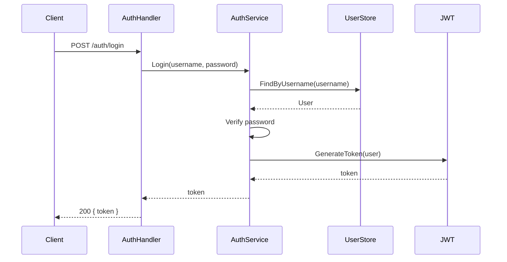

# ADR-0002: Autonomous Development Management Team

## Status

Proposed — 2026-06-11. Updated 2026-06-16.

## Context

Development of the San project (`genai-io/san`) currently relies on a
human to drive the agent in every session. Issues, features, and bugs
are not managed autonomously.

The goal is to make San a **fully AI-managed project**: humans only
express intent ("build feature X", "fix all P0 bugs"), and a team of
Personas handles everything — breaking down requirements, designing
architecture, writing code, running tests, and shipping releases.
Humans stop writing code and only state what they want.

## Core Model

Under the existing Org (`genai-io`), create a **new, separate Repo**
`san-team` for storing the San development team's Personas.
Each team is a collection of Personas that collaborate on a specific project.

Each Persona follows the
[`persona-system.md`](../../notes/active/persona-system.md) design spec.

```
genai-io（Org, existing）
├── san              ← San source repo (existing, the managed project)
└── san-team         ← New repo (pure content, no Go code)
    ├── leader/
    │   ├── system/
    │   │   ├── identity.md
    │   │   ├── behavior.md
    │   │   └── rules.md
    │   ├── skills/
    │   └── settings.json
    ├── dev/
    │   ├── system/
    │   │   ├── identity.md
    │   │   ├── behavior.md
    │   │   └── rules.md
    │   ├── skills/
    │   └── settings.json
    ├── qe/
    │   ├── system/
    │   │   ├── identity.md
    │   │   ├── behavior.md
    │   │   └── rules.md
    │   ├── skills/
    │   └── settings.json
    ├── release/
    │   ├── system/
    │   │   ├── identity.md
    │   │   ├── behavior.md
    │   │   └── rules.md
    │   ├── skills/
    │   └── settings.json
    ├── state/             ← queue.jsonl lives here
    └── run.sh             ← polling loop (12-line shell script)
```

- **`san-team`**: A pure-content repo — no Go code, no binaries. Contains
  only persona markdown files, a shared state directory, and a shell script
  for the polling loop. All Go logic lives in San as reusable features.
- **Team**: A collection of Personas in the `san-team` repo that
  collaborate toward a specific goal — managing the San project's issues,
  features, bugs, and releases.
- **Persona directory**: Each Persona follows the persona spec's three-layer
  structure:
  1. `system/` — system prompt split into `identity` (who), `behavior` (how),
     `rules` (constraints). The fourth part `environment` is computed at runtime.
  2. `skills/` — Persona-scoped skills, activated at startup.
  3. `settings.json` — config overlay: tools, permissions, model, max_steps, etc.

## Runtime Model

Each Persona runs as an **independent San instance**. The runtime model
differs by persona role:

### Leader — Interactive TUI

Leader is the admin's conversation partner. Runs as a standard interactive
San session with the leader persona loaded:

```bash
san --persona leader
```

This uses San's existing `--persona` flag, which loads persona config
from `~/.san/personas/leader/` (a symlink to `san-team/leader/`).

### Dev, QE, Release — Headless via run.sh

These personas run headlessly via `san --persona <name> -p`, launched by
`run.sh`. They do not need interactive terminals — they poll the queue,
claim tasks, execute them, and update the queue:

```bash
# In terminal 2: start Dev polling loop
./run.sh dev /path/to/san

# In terminal 3: start QE polling loop
./run.sh qe /path/to/san

# In terminal 4: start Release polling loop
./run.sh release /path/to/san
```

`run.sh` is a simple shell script (see below). Each persona's system prompt
(identity + behavior + rules) is loaded by `san --persona <name> -p` from
`~/.san/personas/<name>/`.

### Setup: Linking Personas

Before starting, link san-team personas into San's persona directory:

```bash
ln -s /path/to/san-team/leader ~/.san/personas/leader
ln -s /path/to/san-team/dev    ~/.san/personas/dev
ln -s /path/to/san-team/qe     ~/.san/personas/qe
ln -s /path/to/san-team/release ~/.san/personas/release
```

All personas — Leader, Dev, QE, Release — use the same `~/.san/personas/`
mechanism. No new persona-loading code is needed.

## run.sh — The Glue Layer

`run.sh` is the only "code" in san-team. It bridges `san queue` and
`san -p`:

```bash
#!/bin/bash
set -euo pipefail
TEAM_DIR="$(cd "$(dirname "$0")" && pwd)"
PERSONA="${1:?usage: $0 <leader|dev|qe|release>}"
CWD="${2:-$(pwd)}"
INTERVAL="${3:-30}"

echo "[san-team:$PERSONA] polling every ${INTERVAL}s, cwd=$CWD"

while true; do
  # 1. Atomically claim next pending task for this persona
  TASK=$(san queue claim --dir "$TEAM_DIR/state" --role "$PERSONA" --persona "$PERSONA" 2>/dev/null || true)
  if [ -n "$TASK" ]; then
    ID=$(echo "$TASK" | jq -r '.id')
    TITLE=$(echo "$TASK" | jq -r '.title')
    DESC=$(echo "$TASK" | jq -r '.description')
    echo "[san-team:$PERSONA] claimed $ID: $TITLE"

    # 2. Build task prompt and run agent headlessly
    PROMPT="Task: $TITLE

    $DESC

    After completing, summarize what you did and any PR links."

    if san --persona "$PERSONA" -p "$PROMPT"; then
      san queue complete --dir "$TEAM_DIR/state" --id "$ID" --persona "$PERSONA"
      echo "[san-team:$PERSONA] completed $ID"
    else
      san queue release --dir "$TEAM_DIR/state" --id "$ID" --persona "$PERSONA"
      echo "[san-team:$PERSONA] released $ID (will retry)"
    fi
  fi
  sleep "$INTERVAL"
done
```

Key design points:
- **Queue operations are the shell's job**: `run.sh` calls `san queue claim`,
  `san queue complete`, `san queue release`. The LLM agent never knows about
  the queue.
- **Persona loading is San's job**: `san --persona <name> -p` loads the
  persona system prompt from `~/.san/personas/`. The shell does not need to
  compose persona files into the prompt.
- **LLM inference is San's job**: `san -p` executes the agent with
  the task description as the user message.
- **The shell is just glue**: claim → run → complete/release. 12 lines.

## Workflow

The admin talks only to the Leader Persona. Leader breaks requirements
into Tasks and writes them to the shared queue via `san queue add`.
Other Personas poll the queue via `run.sh`, claim matching tasks,
complete them, and update the queue status.

```
Admin (human)
    │
    │  "Build user authentication"
    ▼
┌────────────────────────────────────────────┐
│ Leader (san --persona leader)              │
│                                            │
│ 1. Understand intent                       │
│ 2. Draw architecture & state diagrams      │
│ 3. Break down into Tasks                   │
│ 4. Write tasks via: san queue add ...      │
│ 5. Monitor: san queue list ...             │
└────────────────┬───────────────────────────┘
                 │  Shared work queue (state/queue.jsonl)
        ┌────────┼────────┐
        ▼        ▼        ▼
  ┌──────────┐ ┌──────┐ ┌─────────┐
  │ run.sh   │ │run.sh│ │ run.sh  │
  │   dev    │ │  qe  │ │ release │
  │          │ │      │ │         │
  │ claim→   │ │claim→│ │claim→   │
  │ san -p   │ │agent │ │ san -p  │
  │ --persona│ │run   │ │--persona│
  │   dev    │ │--qe  │ │ release │
  │ →complete│ │→verify│ │→complete│
  └──────────┘ └──────┘ └─────────┘
```

### Leader Persona — Single Entry Point

Started via `san --persona leader`. The admin's only interface. Leader
handles:

1. **Understand intent**: new feature? bug fix? refactor?
2. **Analyze San**: read design docs and existing code in the San repo
3. **Visualize**: draw mermaid architecture/state diagrams, confirm with admin
4. **Break down**: decompose into Tasks, write to shared work queue via
   `san queue add --dir state/ --role dev --title "..." --description "..."`
5. **Monitor**: track Task status via `san queue list --dir state/`
6. **Report**: collect results, summarize for the admin

Leader does not write code. It writes Tasks to the queue; the matching
Persona's `run.sh` loop picks them up automatically.

```
Leader dispatches a coding task:

Leader:
  1. After analysis, determines Task-3 is a coding task
  2. Runs: san queue add --dir state/ --role dev --title "Implement JWT..."
  3. Dev's run.sh polls queue, finds Task-3 matching its role
  4. Dev claims Task-3 via san queue claim, runs san --persona dev -p ".."
  5. Agent completes, run.sh calls san queue complete with PR link
  6. Leader polls queue via san queue list, sees Task-3 done
```

### Dev Persona — Implementation

Launched by `run.sh dev`. Continuously polls the queue for coding tasks:

1. `run.sh` claims Tasks from queue with role `dev` via `san queue claim`
2. Builds prompt from task description
3. Runs `san --persona dev -p "..."
4. Agent reads San's design docs and existing code
5. Agent implements following the layered architecture conventions
6. Agent writes unit tests (in the same package)
7. Agent runs `make test` + `make lint`
8. Agent commits, creates PR
9. On success: `run.sh` calls `san queue complete --id $ID --pr <url>`
10. On failure: `run.sh` calls `san queue release --id $ID`

The Dev agent never touches the queue — `run.sh` handles all queue
operations based on the agent's exit code.

### QE Persona — Verification

Launched by `run.sh qe`. Continuously polls the queue for verification tasks:

1. `run.sh` claims Tasks from queue with role `qe`
2. Runs `san --persona qe -p "..."
3. Agent checks out the PR branch
4. Agent runs full test suite + lint + layer check
5. Agent adds integration tests in `test-integration/`, commits to same PR
6. Agent posts PR review
7. On pass: `run.sh` calls `san queue verify --id $ID --result "passed"`
8. On fail: `run.sh` calls `san queue release --id $ID --reason "..."`

QE can also verify designs before implementation starts (Leader creates
a `role: qe` task with the design doc to review).

### Release Persona — Shipping

Launched by `run.sh release`. Continuously polls the queue for release tasks:

1. `run.sh` claims Tasks from queue with role `release`
2. Runs `san --persona release -p "..."
3. Agent generates CHANGELOG
4. Agent bumps version number
5. Agent creates Git tag
6. Agent generates release notes
7. On success: `run.sh` calls `san queue complete --id $ID`

### Shared Work Queue

The queue is the sole communication mechanism between Personas, stored
at `san-team/state/queue.jsonl` (JSONL append-only log). All operations
go through the `san queue` subcommand (see [ADR-0003](0003-shared-work-queue.md)).

```
type WorkItem struct {
    ID          string       // unique identifier
    Role        string       // dev / qe / release
    Title       string       // task title
    Description string       // task description (filled by Leader)
    Status      ItemStatus   // pending → claimed → done → verified
    AssignedTo  string       // claiming Persona name
    PR          string       // PR link (filled by Dev)
    Result      string       // result notes (filled by QE/Release)
    CreatedAt   time.Time
    UpdatedAt   time.Time
    ClaimedAt   time.Time
    RetryCount  int
    MaxRetries  int
}
```

State transitions:

```
pending ──claim()──→ claimed ──complete()──→ done ──verify()──→ verified
   ↑                     │                       │
   └──release()─── ← (timeout)          ← reject() ──┘
                         │
                         └──fail()──→ failed
```

## Complete Setup Example

A step-by-step walkthrough from zero to running team.

### Prerequisites

```bash
# San CLI must be built and on PATH
cd /path/to/san
make build
export PATH="$PATH:$PWD/bin"

# san-team repo cloned alongside san
cd /path/to
git clone git@github.com:genai-io/san-team.git
```

### Step 1: Link personas

```bash
ln -s /path/to/san-team/leader  ~/.san/personas/leader
ln -s /path/to/san-team/dev     ~/.san/personas/dev
ln -s /path/to/san-team/qe      ~/.san/personas/qe
ln -s /path/to/san-team/release ~/.san/personas/release
```

### Step 2: Start Leader (interactive)

```bash
# Terminal 1: Leader session
cd /path/to/san
san --persona leader
```

The admin interacts with Leader here. For example:

```
Admin: Build user authentication with JWT login

Leader:
  Reads docs/design/ → analyzes codebase → draws sequence diagram
  Confirms with admin → breaks down into tasks:

  $ san queue add --dir /path/to/san-team/state --role dev \
      --title "Define User model and UserStore interface" \
      --description "Create User struct (ID, Username, PasswordHash, CreatedAt)..."

  $ san queue add --dir /path/to/san-team/state --role dev \
      --title "Implement UserStore with SQLite" \
      --description "Implement UserStore interface using SQLite..."

  $ san queue add --dir /path/to/san-team/state --role dev \
      --title "Implement JWT token generation and verification" \
      --description "Create internal/core/jwt/ package..."

  $ san queue add --dir /path/to/san-team/state --role dev \
      --title "Implement POST /auth/login handler" \
      --description "Create login API handler..."

  $ san queue add --dir /path/to/san-team/state --role qe \
      --title "Verify auth module (tasks 1-4)" \
      --description "Check out each PR, run tests, add integration tests..."

  $ san queue add --dir /path/to/san-team/state --role release \
      --title "Ship v1.3.0 with user authentication" \
      --description "Generate CHANGELOG, bump version, tag v1.3.0..."
```

### Step 3: Start worker personas (headless)

```bash
# Terminal 2: Dev polling loop
cd /path/to/san-team
./run.sh dev /path/to/san 30

# Terminal 3: QE polling loop
cd /path/to/san-team
./run.sh qe /path/to/san 30

# Terminal 4: Release polling loop
cd /path/to/san-team
./run.sh release /path/to/san 60
```

### Step 4: Watch progress

```bash
# Any terminal: check queue status
san queue list --dir /path/to/san-team/state
```

Output example:

```
ID        Role     Title                              Status     Assigned  PR
a1b2c3d4  dev      Define User model and interface    done       dev       #123
b2c3d4e5  dev      Implement UserStore with SQLite    done       dev       #124
c3d4e5f6  dev      Implement JWT token generation     claimed    dev       -
d4e5f6a7  dev      Implement POST /auth/login         pending    -         -
a7b8c9d0  qe       Verify auth module (tasks 1-4)     pending    -         -
b8c9d0e1  release  Ship v1.3.0                        pending    -         -

Total: 6 | pending: 3 | claimed: 1 | done: 2 | verified: 0 | failed: 0
```

### What happens inside run.sh

When Dev's `run.sh` polls and finds a pending task:

```
1. san queue claim --dir state/ --role dev --persona dev
   → Returns JSON: {"id":"d4e5f6a7...", "title":"Implement POST /auth/login", ...}
   → Task status is now "claimed"

2. san --persona dev -p ".." --prompt "Task: Implement POST /auth/login
   Create login API handler at internal/app/authhandler/..." --cwd /path/to/san
   → Agent loads dev persona from ~/.san/personas/dev/
   → Agent implements the handler + unit tests
   → Agent creates PR #126
   → Agent exits 0 (success)

3. san queue complete --dir state/ --id d4e5f6a7 --persona dev --pr "https://github.com/genai-io/san/pull/126"
   → Task status is now "done"

4. sleep 30, repeat
```

If the agent fails:

```
1. san queue claim ...  (same)
2. san --persona dev -p "..."
   → Agent hits an error, exits 1 (failure)
3. san queue release --dir state/ --id d4e5f6a7 --persona dev
   → Task status reverts to "pending", retryCount++
   → Next poll will claim it again (up to maxRetries)
```

## Complete Workflow Example

Admin input: **"Implement user authentication with JWT login"**

### 1. Leader understands + draws diagrams

Leader reads San's `docs/design/`, analyzes existing code, generates a
mermaid sequence diagram:



Leader shows the diagram: "This is how I understand the flow — correct?"

### 2. Break down and write to queue

After admin confirmation, Leader writes Tasks to the shared queue:

```
$ san queue add --dir state/ --role dev --title "Define User model and UserStore interface" \
    --description "Create User struct (ID, Username, PasswordHash, CreatedAt) in internal/core/user.go..."

$ san queue add --dir state/ --role dev --title "Implement UserStore with SQLite" \
    --description "Implement UserStore interface using SQLite..."

$ san queue add --dir state/ --role dev --title "Implement JWT token generation & verification" \
    --description "Create internal/core/jwt/ package..."

$ san queue add --dir state/ --role dev --title "Implement login API handler" \
    --description "Create login API handler at internal/app/authhandler/..."

$ san queue add --dir state/ --role qe --title "Verify full auth functionality" \
    --description "Check out PRs, run tests, add integration tests..."

$ san queue add --dir state/ --role release --title "Ship v1.3.0" \
    --description "Generate CHANGELOG, bump version, tag v1.3.0..."
```

### 3. Personas claim and execute

```
Dev's run.sh polls queue:
  Claims Task 1 → san --persona dev -p ".." → implements → PR #123 → complete
  Claims Task 2 → san --persona dev -p ".." → implements → PR #124 → complete
  Claims Task 3 → san --persona dev -p ".." → implements → PR #125 → complete
  Claims Task 4 → san --persona dev -p ".." → implements → PR #126 → complete

QE's run.sh polls queue:
  Sees Tasks 1-4 done → claims Task 5
  san --persona qe -p ".." → checks out PRs → runs tests → adds integration tests
  → passes → san queue verify

Leader monitors all verified → notifies admin to approve PRs
Admin approves → Leader runs:
  $ san queue add --dir state/ --role release --title "Ship v1.3.0" ...

Release's run.sh polls queue:
  Claims Task 6 → san --persona release -p ".." → changelog → tag → complete

Leader → Admin: "Authentication feature complete and shipped. PRs: #123-#126"
```

## Bug Fix Flow

Admin tells Leader: **"Scan and fix all P0 bugs"**

```
Leader:
  1. Pulls all P0 bug issues from San repo via gh
  2. Analyzes each, writes to queue:
     $ san queue add --dir state/ --role dev --title "Fix #100 nil pointer in auth.go" ...
     $ san queue add --dir state/ --role dev --title "Fix #102 timeout in db query" ...

Dev's run.sh:
  Claims "#100" → san --persona dev -p ".." → fix → PR → complete
  Claims "#102" → san --persona dev -p ".." → fix → PR → complete

QE's run.sh:
  Claims "#100 verify" → san --persona qe -p ".." → verify → passes
  Claims "#102 verify" → san --persona qe -p ".." → verify → passes

Leader notifies admin to approve → admin approves

Release's run.sh:
  Claims "hotfix release" → changelog → tag → complete

Leader → Admin: "2 P0 bugs fixed and shipped"
```

## Persona Configuration Examples

Each Persona is a persona directory. Using Dev as an example:

### system/identity.md（Who am I?）

```markdown
You are the Dev agent for the San project.
Your job is to implement coding tasks assigned to you.
You are an expert Go developer familiar with San's five-layer package architecture.
```

### system/behavior.md（How do I act?）

```markdown
## Work habits

1. Read relevant design docs and existing code first — understand context before acting
2. Follow the 5-layer architecture dependency direction: cmd → app → feature → core → infrastructure
3. Every change must include unit tests in the same package
4. Run make test and make lint after changes — only proceed if they pass
5. Commit with clear messages, create a PR, and report the PR link

## Communication style

- When uncertain about a design decision, note it in your result for the Leader
- On completion, summarize what you did, which files changed, and the PR link
- Do not go beyond the assigned Task scope
```

### system/rules.md（What rules do I follow?）

```markdown
## Safety constraints

- Never modify .env, credentials, or key files
- Never run destructive commands (rm -rf, force push, etc.)
- Never skip git hooks (--no-verify)

## Git conventions

- Branch naming: feat/<issue>-<slug> or fix/<issue>-<slug>
- Follow the project's commit message conventions
- Reference the issue in the PR description

## Code conventions

- New packages must have a corresponding docs/packages/<pkg>.md
- Interface changes must update the Contract section
- No circular dependencies
```

### settings.json

```json
{
  "description": "San project Dev Persona — implements code and submits PRs",
  "model": "claude-sonnet-4-6",
  "maxSteps": 80,
  "skills": {
    "code-review": "active",
    "simplify": "active"
  },
  "pollInterval": "30s",
  "disabledTools": {},
  "permissions": {
    "defaultMode": "acceptEdits",
    "allow": [
      "Bash(make:*)",
      "Bash(go:*)",
      "Bash(git:*)",
      "Bash(gh:*)"
    ],
    "deny": [
      "Bash(rm -rf:*)",
      "Bash(git push --force:*)",
      "Bash(git reset --hard:*)"
    ]
  }
}
```

### Leader's system/identity.md

```markdown
You are the Leader Agent for the San project — the single entry point
for all admin interactions. You understand requirements, analyze the project,
draw architecture diagrams, break down tasks, and write them to the shared queue.
You do not write business code yourself — your job is planning, orchestration,
and decision-making.
```

### Leader's settings.json

```json
{
  "description": "San project Leader Persona — single admin entry point",
  "model": "claude-opus-4-7",
  "maxSteps": 200,
  "skills": {},
  "pollInterval": "10s",
  "permissions": {
    "defaultMode": "acceptEdits",
    "allow": [
      "Bash(make:*)",
      "Bash(go:*)",
      "Bash(git:*)",
      "Bash(gh:*)"
    ],
    "deny": [
      "Bash(rm -rf:*)",
      "Bash(git push --force:*)"
    ]
  }
}
```

## Key Design Decisions

### 1. Persona directory

Each Persona follows the persona spec defined in
[`persona-system.md`](../../notes/active/persona-system.md). A Persona is a
folder containing `system/` (split into identity/behavior/rules/environment),
`skills/`, and `settings.json`. Missing parts fall back to San's built-in defaults.

### 2. Personas stored in a separate `san-team` repo

Persona definitions live in a dedicated repo, separate from the San source:
- Independent version history for Persona configs
- Different access permissions for the san-team repo
- Team Personas can manage multiple target repos (future)

### 3. san-team is pure content — no Go code

san-team contains only markdown files, `state/`, and a shell script. All Go
logic lives in San as reusable, independently useful features:
- `san queue` — atomic work queue operations (see [ADR-0003](0003-shared-work-queue.md))
- `san --persona <name> -p` — headless agent with persona system prompt

This separation means san-team has no build step, no dependencies, and can
be modified by anyone comfortable with markdown and shell scripts.

### 4. Leader is the single entry point

The admin never talks directly to Dev/QE/Release:
- Simple mental model: one conversation partner
- Leader has global visibility to prioritize and handle conflicts
- Other Personas focus only on their queue tasks, don't need global context

### 5. Each Persona is an independent San instance

Instead of nested sub-agent calls via the Agent tool, each Persona runs
as an independent San process:
- **Leader**: `san --persona leader` — interactive TUI, talks to admin
- **Dev/QE/Release**: `san --persona <name> -p` — headless, launched by `run.sh`

Benefits:
- Process-level isolation: each Persona has its own context, tools, permissions
- Can be deployed on different machines/containers, independently scaled
- Coordination through the shared work queue (file-based), no IPC needed
- All persona loading unified under `~/.san/personas/`

### 6. Architecture diagrams as communication language

Leader draws mermaid diagrams before writing any code:
- Admin confirms understanding (avoids building the wrong thing)
- Dev Persona gets a clear reference (diagrams ship with Task descriptions)
- QE Persona gets a verification checklist

### 7. Persona Self-Evolution

Every Persona continuously learns and self-improves during the project.
Evolution is persisted by updating the Persona's configuration in the
`san-team` repo.

**Learning sources:**
- After each Task, Persona writes a retrospective: what worked, what to improve
- Failure patterns found by QE feed back to Dev, updating `behavior.md` or `rules.md`
- Leader observes Persona performance and periodically tunes configurations

**Evolution targets:**

| Element | Method | Example |
|---|---|---|
| Skills | Discover useful skills → update `skills` in `settings.json` | QE finds `bug-hunt` effective → sets to `active` |
| Permissions | Permission gap found → Leader evaluates → update `permissions.allow` | Dev needs a new tool → Leader approves and adds |
| Rules | Learn from failures → update `system/rules.md` | Repeated QE rejections due to missing tests → strengthen test rules |
| Workflow | Find efficiency bottleneck → update `system/behavior.md` | "Read design docs first" proves more efficient → codify as behavior |

**Evolution flow:**
```
Task complete → Persona writes retrospective → identifies improvements
  → Persona proposes change to Leader
  → Leader approves
  → Update Persona config in san-team repo (via PR)
  → Next startup auto-loads new config
```

**Safety constraints:**
- Permission changes must be approved by Leader; Persona cannot self-elevate
- All config changes go through Git PR with full audit history
- Admin can roll back to any previous config version at any time

## Relationship to Existing Architecture

| New Concept | Existing / Planned Mechanism |
|---|---|
| Persona directory | `~/.san/personas/` (existing persona system) |
| `san --persona leader` | Existing `--persona` flag (no change) |
| `san --persona <name> -p` | Existing: `-p` print mode with `--persona` (PR #231) |
| Shared work queue | New: `san queue` subcommand (see ADR-0003) |
| run.sh polling loop | 12-line shell script in san-team |
| Persona communication | Queue polling via `san queue`, no inter-process RPC |
| Persona permissions | settings.json permissions (existing mechanism) |

## Implementation Plan

### Phase 1 — Create `san-team` repo

- Create `san-team` repo under `genai-io` Org
- Write four Persona directories (leader/dev/qe/release)
- Each with `system/{identity,behavior,rules}.md` + `skills/` + `settings.json`
- Create `run.sh` polling script
- Create `state/` directory (queue.jsonl created at runtime)

### Phase 2 — Add `san queue` subcommand to San

- Implement `internal/queue/` package (item, queue, claim) — ~200 lines
- Wire `cmd/san/queue.go` cobra subcommand
- Commands: list, claim, add, complete, verify, release, fail
- See [ADR-0003](0003-shared-work-queue.md) for details

### Phase 3 — `--persona` + `-p` integration (done, PR #231)

- Fix `runPrint` to load persona system prompt when `--persona` and `-p` are
  combined
- Load persona from `~/.san/personas/<name>/` and build system prompt via
  `system.Build()` with persona identity/behavior/rules
- Apply persona's settings.json model and disabledTools
- This replaces the need for `run.sh` to compose persona files into the prompt

### Phase 4 — End-to-end workflows

- Leader: `san --persona leader` → understand → break down → `san queue add`
- Dev: `run.sh dev` → `san queue claim` → `san --persona dev -p ".."` → `san queue complete`
- QE: `run.sh qe` → `san queue claim` → `san --persona qe -p ".."` → `san queue verify`
- Release: `run.sh release` → `san queue claim` → `san --persona release -p ".."` → `san queue complete`
- Leader: `san queue list` → monitor → report to admin

### Phase 5 — Automation and operations

- Cron-triggered bug scanning → auto-write to queue
- Auto-trigger Leader task breakdown on design doc merge
- Progress dashboard (`san queue list`)
- `san queue compact` for JSONL compaction

## Reference Skills

The following are existing community skills from GitHub. Each Persona can
directly adopt them or use them as design references.

### Leader Persona

| Skill | Source | Stars | Purpose |
|---|---|---|---|
| `/plan` + `/work` | [jdelfino/agent-workflow](https://github.com/jdelfino/agent-workflow) | 9 | Decompose requirements into dependency-tracked subtasks, create Epics with beads |
| `/todo-task-planning` + `/todo-task-run` | [gendosu/agent-skills](https://github.com/gendosu/agent-skills) | 0 | Two-phase workflow: analyze → structured TODO.md → execute step-by-step → PR |
| `/backlog:plan` + `/backlog:standup` | [backloghq/backlog](https://github.com/backloghq/backlog) | 3 | Persistent cross-session task management with dependencies, priority, due dates |
| `/dev` (6-phase SOP) | [hnaymyh123-henry/claude-dev-skill](https://github.com/hnaymyh123-henry/claude-dev-skill) | 112 | Tech Lead mode: PRD alignment → architecture → parallel dev → QA → CR + merge |
| `project-manager` | [gendosu/agent-skills](https://github.com/gendosu/agent-skills) | 0 | Task organization and project management |

### Dev Persona

| Skill | Source | Stars | Purpose |
|---|---|---|---|
| `implementer` | [jdelfino/agent-workflow](https://github.com/jdelfino/agent-workflow) | 9 | Test-first dev in isolated worktrees, triggers parallel reviews on completion |
| `git-operations-specialist` | [gendosu/agent-skills](https://github.com/gendosu/agent-skills) | 0 | Git history analysis, conflict resolution, branch strategy, GitHub CLI |
| `micro-commit` | [gendosu/agent-skills](https://github.com/gendosu/agent-skills) | 0 | Fine-grained commits following micro-commit methodology |
| Parallel Worker Agents | [hnaymyh123-henry/claude-dev-skill](https://github.com/hnaymyh123-henry/claude-dev-skill) | 112 | Multiple Worker Agents in isolated worktrees, 6-category self-check |

### QE Persona

| Skill | Source | Stars | Purpose |
|---|---|---|---|
| `bug-hunt` (Hunter + Skeptic + Referee) | [danpeg/bug-hunt](https://github.com/danpeg/bug-hunt) | 142 | Adversarial bug finding: Hunter over-reports → Skeptic dismisses → Referee adjudicates |
| Jenny (Implementation Verification) | [darcyegb/ClaudeCodeAgents](https://github.com/darcyegb/ClaudeCodeAgents) | 716 | Verifies implementation against project specs |
| Karen (Reality Check) | [darcyegb/ClaudeCodeAgents](https://github.com/darcyegb/ClaudeCodeAgents) | 716 | Honest assessment of completion vs. claims, identifies half-finished work |
| Code Quality Pragmatist | [darcyegb/ClaudeCodeAgents](https://github.com/darcyegb/ClaudeCodeAgents) | 716 | Detects over-engineering, needless abstractions, premature optimization |
| Task Completion Validator | [darcyegb/ClaudeCodeAgents](https://github.com/darcyegb/ClaudeCodeAgents) | 716 | Confirms features marked "done" work end-to-end |
| UI Comprehensive Tester | [darcyegb/ClaudeCodeAgents](https://github.com/darcyegb/ClaudeCodeAgents) | 716 | Cross-platform UI testing (Puppeteer/Playwright) |
| `correctless` (32 skills) | [joshft/correctless](https://github.com/joshft/correctless) | - | Spec-driven TDD with agent separation: Spec → Test → Implement → QA → Verify |
| `skill-test` pipeline | [easyfan/skill-test](https://github.com/easyfan/skill-test) | - | Testing pipeline: static review → behavioral eval → deployment verification |
| 4 Reviewer types | [jdelfino/agent-workflow](https://github.com/jdelfino/agent-workflow) | 9 | Parallel reviews: correctness, tests, architecture, plan conformance |
| QA Agent (Phase 3.5) | [hnaymyh123-henry/claude-dev-skill](https://github.com/hnaymyh123-henry/claude-dev-skill) | 112 | 6-category counterexample self-check (Null/Empty/Boundary/External/Concurrency/Malicious) |

### Integration Strategy

1. **Direct adoption**: Copy the repo's `.claude/skills/` into the Persona's `skills/` directory
2. **Reference design**: Extract patterns (agent separation, adversarial verification,
   multi-stage review) and rewrite for the San project
3. **Priority**: Community skills (marketplace scope) rank below project-custom skills;
   Leader must approve before enabling

## Additional Decisions

1. **Parallel Dev instances**: Each Dev San instance
   works in its own git worktree and submits PRs independently. If
   multiple PRs touch the same file, GitHub's merge conflict mechanism
   handles it. When Leader detects a conflict, it creates a new fix task.
2. **Leader merge authority**: All code must be manually approved by the admin
   before merging — no automatic merge. After QE passes, Leader notifies the
   admin to approve; the admin just clicks approve.
3. **Failure retry strategy**: The Leader decides the max retry count per Task
   (default 3). When Dev exhausts retries and still fails QE, `run.sh` calls
   `san queue fail`, marking the Task as `failed`. Leader detects this and
   notifies the admin.
4. **Crash recovery**: All failure scenarios (Persona crash, Leader crash,
   queue file corruption, etc.) must be handled gracefully and reported to
   the admin:
   - Persona crash: claimed Tasks timeout and auto-revert to pending; Leader
     detects the reversion and notifies the admin
   - Leader crash: admin restarts Leader, which replays the queue to restore context
   - Queue file corruption: recover the last good snapshot from Git history
   - `run.sh` crash: simply restart the script; it picks up where it left off
     (any claimed task auto-reverts after timeout)
5. **Future team repos**: Beyond `san-team`, what infrastructure
   will teams like `devops-team` need?

## References

- [`persona-system.md`](../../notes/active/persona-system.md) — persona design spec that Persona directories follow
- [ADR-0003](0003-shared-work-queue.md) — shared work queue design (`san queue`)
- [`san-team/DESIGN.md`](../../../san-team/DESIGN.md) — prompt-first san-team design
- [`san-team/state/EXAMPLE.md`](../../../san-team/state/EXAMPLE.md) — queue examples
- [`core.Agent`](../../packages/core.md) — underlying agent primitive
- [`packages/subagent.md`](../../packages/subagent.md) — sub-agent mechanism
- [`packages/skill.md`](../../packages/skill.md) — skill loading
- [`concepts/permission-model.md`](../../concepts/permission-model.md) — permission model
- [`ADR-0001`](0001-layered-package-architecture.md) — layered package architecture
