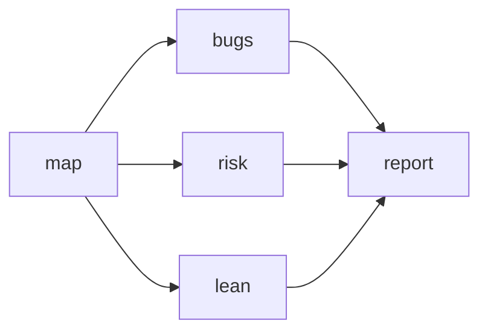

## map
mode: explore

只读调查 {{input.scope}}。scope 为 . 时审计整个仓库；也可以是一个目录或包。不要修改文件。
先读 README、构建和部署配置、依赖清单、入口（main、路由、处理器、后台作业、CLI）以及测试。判断这里的预期负载是单人脚本，还是多用户、多进程服务，并明确写出假设。
沿主要路径追踪输入、存储和输出；优先看用户输入、认证、金额、数据写入、后台作业和跨进程共享状态。仓库很大时，深入检查出错代价最高的路径，并列出尚未读到的部分。

输出一份简洁的地图，包含：仓库做什么、审计范围、预期负载、入口与关键数据流、高风险路径、未检查的范围。附关键文件路径。只做地图，不在这一步写审计结论。

## bugs
mode: explore

审计 {{input.scope}} 的正确性。先使用这份地图定位关键路径：
{{map}}

查错误结果、崩溃、空值和边界值、时间与舍入问题，以及调用方与函数契约不一致、同一规则在不同路径上实现不同的情况。沿关键数据流读完整的相关路径。
每个候选问题必须有具体触发输入或情境、可核对的 file:line 证据、影响、最小修复办法，以及不修复的后果。没有具体复现路径就不要报。只读，不改代码；没有发现可复现问题就明确说出。

## risk
mode: explore

审计 {{input.scope}} 的安全、数据完整性和预期负载。以地图中的负载假设和关键路径为准：
{{map}}

检查注入、弱随机数、泄露的秘密、缺失的输入检查、吞掉的错误、错误的写入顺序和缺失的事务；再查并发下的先检查后写入、每个进程重复执行的工作、无限增长的内存或列表、逐项查询、明显的 O(n²) 热路径，以及本应共享却只保存在进程内的状态。
每个候选问题必须给出实际触发情境、file:line 证据、影响、最小修复办法和不修复的后果。只报告会在预期负载下发生的问题，不把单人脚本的假想规模当作故障。只读，不改代码；没有发现可复现问题就明确说出。

## lean
mode: explore

审计 {{input.scope}} 中高风险逻辑的测试、实际慢路径与冗余代码。先看地图：
{{map}}

找缺少一个能在逻辑出错时失败的测试的解析器、分支、安全检查或数据写入；找真正影响使用的慢路径；找可删的死代码和无用选项、重复 helper、标准库已经能完成的工作、只有一个实现的多余抽象，以及因混合了不同职责而难以理解的函数。
说某段代码“未使用”之前，必须搜索整个仓库，包括测试、配置、fixture、字符串引用和动态调用。标有 ponytail: 注释且说明限制的捷径，只有在预期负载越过限制时才算问题。每条都要有具体情境、file:line 证据、最小修复办法和不修复的后果。不要提出纯风格意见；倾向于能删代码的修复。只读，不改代码；没有可靠发现就明确说出。

## report
mode: explore

把地图和三份独立审计合成一份完整的英文报告：

地图：{{map}}

正确性：{{bugs}}

安全与负载：{{risk}}

测试、性能与精简：{{lean}}

报告前重新核对每条候选结论的源码位置和触发情境；对“未使用”的判断重新搜索整个仓库。去重，删除没有具体情境或证据的推测。按正确、安全、预期负载、测试、速度、精简的优先级排序。最多 20 条；如舍弃了更小的问题，注明数量。不要修改文件。

用简单、短句的英文。开头写 `What this repo does:`，用两三句话说明仓库用途与负载假设。随后只输出非空的 **Must fix**、**Should fix**、**Nice to have** 组，所有组共用连续编号。每条包含加粗标题与 `file:line`，以及各一两句的 **What this is:**、**Problem:**、**Fix:**、**If we skip it:**。修复建议优先选择能删除代码的最小办法，不增添不必要的框架或配置。

结尾写一行 `Verdict:`。只有精简发现有可核实的估算时才写 `Lean: -<N> lines, -<M> dependencies possible.`；最后写 `Not checked:` 并列出实际未检查或无法运行的部分。若没有可靠发现，只写 `What this repo does:`、`Healthy. Nothing to fix.` 和检查范围的一行说明。
