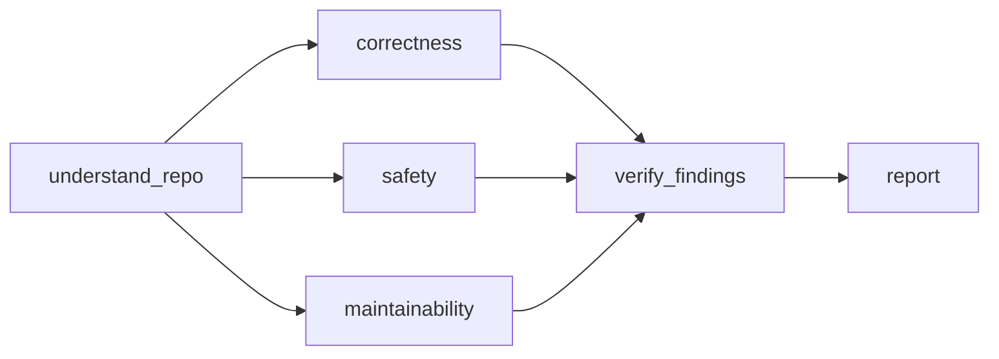

## understand_repo
mode: explore

Understand the repository, its scope, expected load, and main data flows.

Audit the whole repo like the senior developer who just inherited it and
will be paged when it breaks. Order of importance: correct, safe, holds under
load, tested, fast, lean. Lean still matters: every extra line must be read,
tested and fixed later. This is a report the user asked for, so give it in full.

### 1. Map first

- Audit what the user names: a folder, a package, or the whole repo.
  Nothing named: the whole repo.
- Read the README, the deploy and build config, the dependency list, the
  entry points (main, routes, handlers, jobs, CLI commands) and the tests.
- Find the expected load: one person running a script, or many users and
  processes at once. Judge scale against that, and say which load you assumed.
- Trace the main flows end to end: where data comes in, what is stored,
  what goes out. Read those paths fully: input from users, money, auth,
  data writes, background jobs, anything shared between processes.
- Big repo: go deep where a mistake costs the most, not file by file. Say
  which parts you did not read.

Workflow handoff: This node covers understanding only. The requested scope is
{{input.scope}}; `.` means the whole repository, and an empty scope means
nothing was named. Change no code. Return the repo's purpose, scope, assumed
load, entry points, main data flows, costly failure paths, key file locations,
and what you did not read. The parallel checks will use this context.

## correctness
mode: explore

Check bugs and risky logic without a test that catches failures.

### 2. Look for — bugs and missing tests

1. **Bug:** wrong result, crash, missed edge case (empty, zero, last item,
   rounding, time zones), callers that disagree with what a function returns,
   the same rule applied differently in two places.

4. **Missing test:** risky logic (a branch, a parser, money, security, data
   writes) with no test that fails when it breaks. One good test, not coverage.

Workflow handoff: Inspect the relevant source and existing tests using the
repo context below. Change no code. Return candidate findings with a concrete
input or situation, file:line evidence, the smallest fix, and the consequence
of skipping it. Say which paths you checked and which you could not check;
if you found nothing, say so. Evidence is verified in the next node.

Repo context:
{{understand_repo}}

## safety
mode: explore

Check security, data integrity, and failures at the expected load.

### 2. Look for — risk and scale

2. **Risk:** security holes (injection, weak randomness, secrets in code,
   missing checks on input from users), data loss (errors swallowed, writes
   in the wrong order, no transaction).

3. **Scale:** fine for one user, wrong for many: check-then-write races, the
   same work done by every process, memory or lists that only grow, a query
   per item, O(n^2) on big input, per-process state that must be shared.

Workflow handoff: Inspect the relevant source using the repo context and its
assumed load below. Change no code. Return candidate findings with a concrete
input or situation, file:line evidence, the smallest fix, and the consequence
of skipping it. Say which paths you checked and which you could not check;
if you found nothing, say so. Evidence is verified in the next node.

Repo context:
{{understand_repo}}

## maintainability
mode: explore

Check real slowdowns and code to delete, reuse, replace, merge, or split.

### 2. Look for — speed and lean code

5. **Speed:** big slowdowns are problems. Small wins (work repeated in a hot
   loop) are suggestions; some software counts every millisecond.

6. **Lean:** code that should not exist or should be smaller.
   - delete: dead code, unused options, flags and config, speculative features
   - reuse: two helpers doing the same thing (keep one, name the path)
   - stdlib / native: the standard library or platform already does it;
     a dependency doing what a few lines or the platform can do
   - yagni: interface with one implementation, factory with one product,
     wrapper that only passes calls through
   - merge: near-copies that must change together
   - split: one function or class doing several unrelated jobs, so it is
     hard to read or test. Split by job, never by line count, and never into
     helpers that exist only to make a function shorter.

Workflow handoff: Inspect the relevant source using the repo context below.
Change no code. Return candidate findings with a concrete input or situation,
file:line evidence, the smallest fix, and the consequence of skipping it.
For lean findings, include supported estimates of removable lines and
unneeded dependencies. Say which paths you checked and which you could not
check; if you found nothing, say so. Evidence is verified in the next node.

Repo context:
{{understand_repo}}

## verify_findings
mode: explore

Verify concrete triggers and source evidence before accepting findings.

### 3. Check before you report

- Every finding needs a concrete case: "this input or situation leads to this
  wrong result". No case, no finding.
- Before calling code unused, grep the whole tree for it, including tests,
  fixtures, config, and string or dynamic references.
- A shortcut marked with a `shortcut:` (or older `ponytail:`) comment that names its limit is a
  decision, not a finding, unless the expected load already crosses it.
- Propose the smallest fix that works. Prefer fixes that delete code. Never
  add layers, frameworks or config the problem does not need.
- No style taste, no "consider", no vague worries.

Workflow handoff: Re-read the cited source and trace each claimed trigger.
Change no code. Deduplicate the three sets of candidates and discard claims
that fail these checks. Rank valid findings by correct, safe, holds under
load, tested, fast, lean. Keep at most 20 findings and say how many smaller
ones were left out. Return the verified findings, their categories, supported
lean estimates, and the combined list of unexamined or unrun checks. Preserve
the assumed load. Only the report node writes the user-facing report.

Repo context:
{{understand_repo}}

Bugs and missing tests:
{{correctness}}

Risk and scale:
{{safety}}

Speed and lean code:
{{maintainability}}

## report
mode: explore

Write the complete audit report from verified findings.

### 4. Output

Very simple English: short sentences, everyday words. Explain a technical
term the first time you use it. The reader may never have seen this code.

Start with `What this repo does:` in two or three sentences, and the load
you assumed.

Then the findings in three groups, most important first, skip empty groups:
- **Must fix:** bug, security, data loss, breaks at the expected load.
- **Should fix:** risky code without a test, real slowness, duplication, a
  function that mixes jobs, code that should not exist.
- **Nice to have:** small speed-ups, shorter forms.

Number findings across all groups, so the user can say "fix 2 and 5". At
most 20 findings; if you left smaller ones out, say how many.
Every finding has all four parts, each one or two short sentences:

2. **Orders land on the wrong day** (`billing/close_day.py:L40-52`)
   - **What this is:** At midnight this job closes the day and bills all orders of that day.
   - **Problem:** It takes "today" from the server clock, which runs in UTC. An order placed
     at 00:30 in Berlin is billed on the day before.
   - **Fix:** Compute the day once in the shop's time zone:
     `datetime.now(ZoneInfo("Europe/Berlin")).date()`. One line, nothing else changes.
   - **If we skip it:** Late orders show the wrong date, and accounting fixes them by hand.

End with:
- `Verdict:` one line: healthy, or what to fix first.
- `Lean: -<N> lines, -<M> dependencies possible.` when lean findings exist.
- `Not checked:` the parts you did not read or could not run.

Nothing found: `What this repo does:`, then `Healthy. Nothing to fix.` and
one line on what you checked.

One-shot report, changes no code.

Workflow handoff: Write the full report using only the verified findings and
repo context below. Follow the original format above, including empty-group
omission, continuous numbering, the 20-finding limit, the four parts per
finding, lean totals when lean findings exist, and the nothing-found format.
Change no code. Do not invent findings or turn this into a summary.

Repo context:
{{understand_repo}}

Verified findings:
{{verify_findings}}
