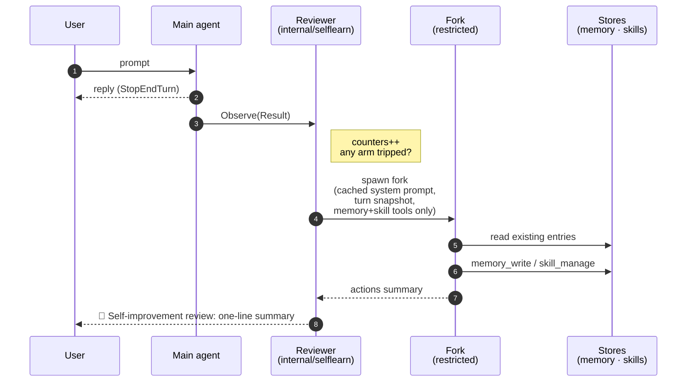
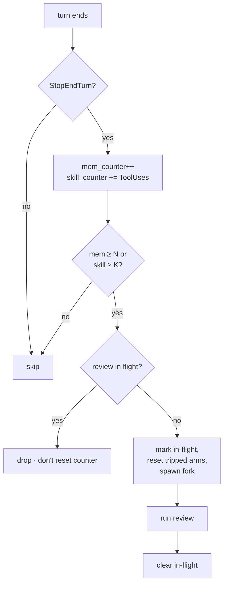
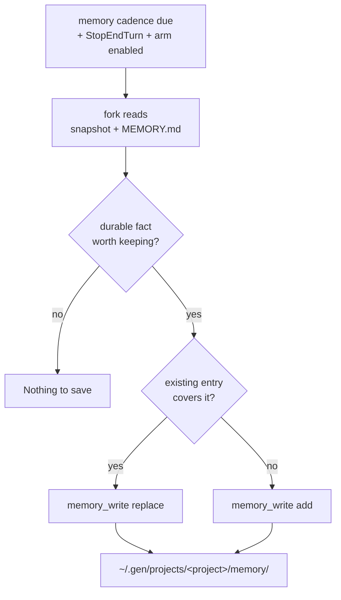
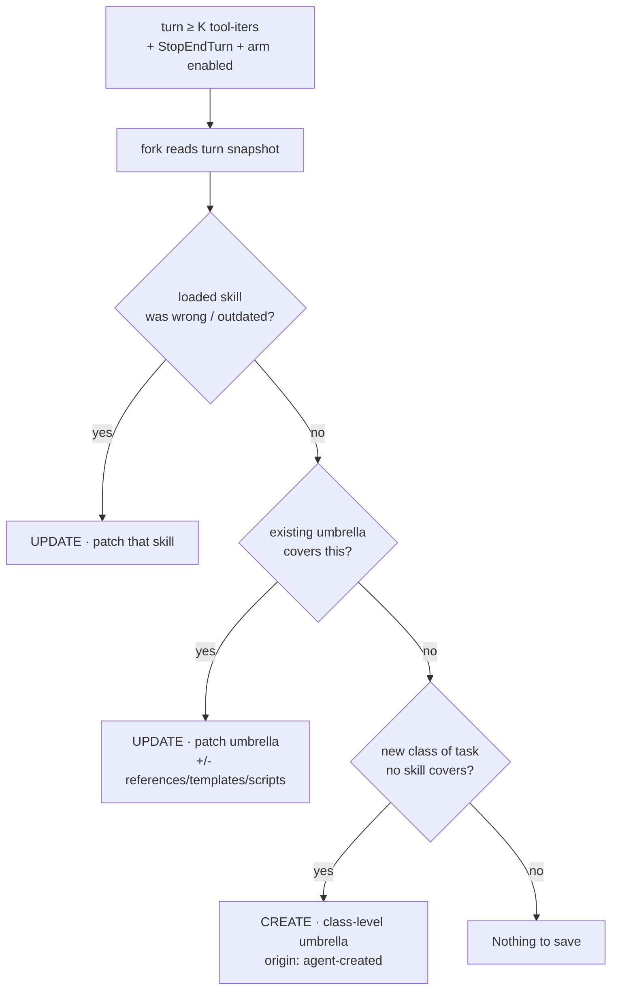

# L1 — Background Review (per-turn self-learning)

Layer 1 of the self-learning loop in [#46](https://github.com/genai-io/gen-code/issues/46).
This is [#52](https://github.com/genai-io/gen-code/issues/52).

**Decision.** After every clean turn, an **out-of-band reviewer fork** writes
to memory/skill stores **directly** — no proposal queue, no human gating. The
fork is best-effort, capped at one in-flight per session, and never touches the
main turn's prompt cache. Collection-level grooming (dedup, contradictions,
unbounded growth) is the job of a later **L2 curator**, designed in its own
issue (rationale in §8).

---

## 1. Three systems compared

| Axis | Hermes (`background_review.py`) | Claude Code (auto memory) | gen-code L1 (this doc) |
|---|---|---|---|
| Where the write decision lives | **Out-of-band** fork | **In-band** main agent | **Out-of-band** (Hermes-aligned) |
| When | After a clean turn | Mid-turn, on model judgment | After a clean turn |
| Writes directly | yes (fork has memory + skill tools) | yes (main agent's own tool) | yes |
| Trigger signals | turns (memory) + tool-iters (skill) | model judgment + explicit "remember this" | **turns + tool-iters** |
| Memory scope | **global** `~/.hermes/MEMORY.md` + `USER.md` | **per-project** `~/.claude/projects/<repo>/memory/` (index + topic files) | **per-project** `~/.gen/projects/<project>/memory/` (Claude-Code-aligned) |
| Skill scope | global, with provenance flags | global, with provenance | **user + project**, `origin: agent-created` field |
| Cache parity | inherits cached system prompt verbatim (≈26% cost cut measured) | n/a (no fork) | inherits verbatim |

**Why this mix.** Hermes' out-of-band shape is the production-proven one (best
turn responsiveness, dedicated reviewer prompt, no main-context bloat); Claude
Code's per-project memory layout is the right home for gen-code's multi-repo
users (worktrees of one repo share a store; different repos don't leak into
each other). gen-code already has the **read/injection side** (memory loads
+ `<system-reminder>` re-emit on PostCompact); L1 only adds the **write side**.

---

## 2. Architecture



Key points the diagram encodes:

- The reviewer is **fed** completed turns (single-consumer outbox is already
  drained by the app); it doesn't subscribe.
- The fork's read side reads current memory + lists existing skills so it can
  pick **update over create** and **replace over append**.
- The user-visible surface is a single line per fork — silent on "Nothing to
  save."

---

## 3. Trigger — two arms



| Arm | Signal | Default | Why this signal |
|---|---|---|---|
| Memory | user turns since last review | every **10** user turns | User-modelling drifts on conversational cadence, not work intensity. |
| Skills | tool iterations **this turn** | when turn ≥ **10** tool-iters | Skill capture should fire when the agent actually *did* work; tool-iters is a cheap, provider-agnostic proxy (tokens are per-provider and post-hoc). |

Both arms count independently and may fire on the same turn (combined prompt).
Counters live in the reviewer and **hydrate from history on session resume**
(memory only — the skill counter is intra-turn).

### 3.1 Configuration

The two arms are toggled and tuned independently via `settings.json` (a new
`selfLearn` section, merged across user / project / local layers like other
gen-code settings):

```json
{
  "selfLearn": {
    "memory": { "enabled": false, "everyTurns": 10 },
    "skills": { "enabled": false, "everyToolIters": 10 }
  }
}
```

- `memory.enabled` / `skills.enabled` — enable each arm separately. Running
  memory-evolving without skill-evolving (or vice versa) is supported.
- `memory.everyTurns` — memory cadence in user turns.
- `skills.everyToolIters` — skill threshold in tool iterations this turn.
- **When both arms are off, no reviewer goroutine is started** — zero
  overhead, no extra model calls, nothing written.
- **Default: off (opt-in).** L1 forks an extra model call per cadence and
  writes files automatically; ship opt-in, default-on later once trusted
  (Claude Code ships auto-memory on — we can match).
- Optional escape hatch: env override `GEN_DISABLE_SELF_LEARN=1`, mirroring
  Claude Code's `CLAUDE_CODE_DISABLE_AUTO_MEMORY`.

---

## 4. Memory flow



**Tool actions:** `add` / `replace` / `remove`. "Nothing to save." is a valid
outcome.

**Anti-patterns (don't save):** one-off task state, transient errors,
"what-we-did-this-session" narratives — none are durable across sessions.

**Store layout.** `~/.gen/projects/<project>/memory/MEMORY.md` is the index;
long detail spills into topic files (`debugging.md`, …) loaded on demand.
`<project>` is the git-repo root path with `/` → `-` (Claude Code's encoding,
e.g. `-Users-me-work-gen-code`), so worktrees of one repo share a store. Fall
back to cwd outside a repo. User-level + project-partitioned is
**machine-local, out of the repo** — no commit/gitignore decision, no agent
churn in git history.

**Injection lifecycle (reuses existing infrastructure).**

| When | What happens |
|---|---|
| Session start | Read `MEMORY.md` index (cap ~200 lines / 25 KB) → inject as `<system-reminder source="memory-auto">` on first user message. Topic files are read on demand by file tools, not injected. |
| PostCompact | Re-read from disk + re-emit reminders (same path as `GEN.md` / `CLAUDE.md`). |
| cwd change | Re-read, because `<project>` changes. |

This requires one small read-side change: extend `LoadMemoryFiles` with a new,
**distinct "auto" source** so agent-written memory and user-authored
`GEN.md` / `CLAUDE.md` never mix. Without this read side, L1 writes would
never be injected.

**Write→visibility lag (by design).** L1 writes out-of-band while the running
session's memory was injected at a load point, so a fresh write becomes
visible at the next load point (next PostCompact / next session) — not
live-patched. Acceptable: memory primarily serves future turns.

---

## 5. Skill flow

> **Umbrella** = a broad, **class-level** skill (e.g. `go-testing`,
> `code-review`) that accumulates many learnings over time, as opposed to a
> **narrow, session-specific** skill (`fix-flaky-test-pr-1234`). It is a
> naming convention, not a stored field — the flow prefers extending an
> umbrella over spawning narrow skills so the library stays "broad and few".



**UPDATE preferred.** Keeps the library broad and avoids near-duplicates.
`skill_manage(patch, …)` to fix/extend; `skill_manage(write_file, …)` to add
a `references/`, `templates/`, or `scripts/` support file (plus a pointer
line in `SKILL.md`). Patch in place, at the existing scope.

**CREATE as last resort.** Names must be **class-level** (`go-table-tests`,
not `fix-pr-1234`). L1 picks the level: reusable/general → user
(`~/.gen/skills/`), project-specific → project (`./.gen/skills/`).

**Provenance is a frontmatter field, not a directory.** Add
`origin: agent-created` to `SKILL.md`; absent ⇒ `user-created`. The `Skill`
struct grows one field (`Origin string`). Skills live directly in gen-code's
existing two scopes — no `agent-created/` subdir, no loader change.

**Scope of L1 writes (Phase 1).** L1 only creates/patches
`origin: agent-created` skills. It **reads** user-created skills (to avoid
duplication) but never modifies them. The future L2 likewise touches only
agent-owned content.

**`skill_manage` actions.** `create`, `edit` (full rewrite — rare), `patch`,
`write_file`, `remove_file`, `delete`. **`patch`** is targeted
find-and-replace with a fuzzy-match chain (exact → line-trimmed → whitespace/
indent/escape/unicode-normalized → block-anchor → context-similarity) and an
**escape-drift guard** (rejects matches where transport-added `\'` / `\"`
backslashes don't exist in the file).

**Three review prompts**, picked by which arms fired (memory / skill /
combined). The skill prompt is **active** (most working sessions produce ≥1
update) and embeds the anti-pattern list.

---

## 6. Fork mechanics — invariants

Fresh `core.Agent` (`core.NewAgent`) in a goroutine, **not**
`subagent.Executor` (which carries registry / hooks / session-persistence a
silent reviewer must not). The fork inherits the parent's `system.System`
verbatim, is seeded with `SetMessages(snapshot)` + a user message carrying
the review prompt, then runs `ThinkAct` under `MaxTurns ≈ 16` and a context
deadline (≈ 5 min).

Eight invariants, each one cost Hermes a production bug:

1. **Run AFTER the user reply is delivered.** Gate on
   `Result.StopReason == StopEndTurn` (skip cancelled / interrupted / max-turns).
2. **Inherit the parent's cached system prompt byte-for-byte** for prefix-cache
   parity (≈26% cost cut on Sonnet 4.5 per Hermes).
3. **Toolset whitelist at dispatch.** `tools[]` matches the parent (cache-key
   parity); a static permission func allows only the **memory + skill
   toolsets** (read *and* write — needs read for dedupe). All else denied.
4. **Static `tool.WithPermission` only** — never `agent.PermissionBridge`
   (would deadlock the TUI). Approvals auto-deny.
5. **Best-effort.** Wrap in `recover`; review failure never affects the user
   turn.
6. **No session-scoped side effects** (no hooks, no session persistence).
7. **Suppress fork status.** Only one line surfaces on the main outbox:
   `💾 Self-improvement review: <summary>` (`MessageEvent`,
   `From: "l1-review"`). Silent on "Nothing to save."
8. **≤1 in-flight fork per session.** Drop new triggers while one runs (log,
   no queue). Counters are **not** reset on drop — the threshold stays
   tripped and re-fires next clean turn.

### Module map

| Concern | Module |
|---|---|
| Trigger + fork | new `internal/selflearn` (observes completed turns, owns counters) |
| Wire-up | `internal/agent/session.go::Task.Start` (start), `stopLocked` (tear down) |
| Fork | `core.NewAgent` directly, restricted `core.Tools` |
| System prompt | pass the parent's `system.System` verbatim |
| Writes | `memory_write` → `~/.gen/projects/<project>/memory/`; `skill_manage` → `~/.gen/skills/<name>/` (user) or `./.gen/skills/<name>/` (project), with `origin: agent-created` |
| Provenance | add `Origin` to skill frontmatter struct (`internal/skill/types.go`); absent ⇒ `user-created` |
| Injection read | memory: extend `LoadMemoryFiles` with a new "auto" source. Skills: no change (existing user/project loader covers it). |

---

## 7. Filesystem layout

```
# Skills (existing scopes, distinguished by origin)
~/.gen/skills/<name>/
├── SKILL.md            origin: agent-created | user-created
├── references/         session-specific detail, condensed knowledge banks
├── templates/          starter files meant to be copied
└── scripts/            re-runnable actions (verification, fixtures)

./.gen/skills/<name>/   project-level (same layout)

# Memory (new "auto" source, machine-local, per-project)
~/.gen/projects/<encoded-cwd>/memory/
├── MEMORY.md           index, ≤200 lines / 25 KB injected
├── debugging.md        topic file, read on demand
└── ...
```

---

## 8. Why a later L2 curator (deferred)

L1 writes with a **local** view (one turn) and **frequently**. Across many
turns the collection drifts in ways no single L1 write can fix:
duplicate/overlapping entries, contradictions, stale facts, unbounded
`MEMORY.md` growth past the injection budget. A separate, idle-triggered
**L2 curator** evaluates the whole collection and dedups / prunes /
consolidates / archives — the role Hermes' `agent/curator.py` plays. Its
evaluation basis (usage telemetry + collection intrinsics) and trigger policy
are out of scope here and tracked in a separate L2 issue.

One L1-side implication worth flagging now: L2's strongest signal will be
**usage** (which skill was used when), which gen-code doesn't record today.
A light usage log can land with L1 or just before L2 — flagged so it isn't
forgotten.

---

## 9. Phasing + next steps

**Phase 1 (this issue, #52)** — Trigger + fork + direct memory/skill writes
+ three review prompts.

Prereqs:
- `skill_manage` tool with patch semantics.
- A first-class memory writer to `~/.gen/projects/<project>/memory/`.
- **Injection read side**: extend `LoadMemoryFiles` to load that store as a
  new, distinct "auto" source (§4) — without this, L1 writes are never injected.

Concrete steps:
1. New package `internal/selflearn`: `Reviewer` (counters + observation +
   trigger), `forkAgent(parent, snapshot, mode)` (restricted `core.Agent`,
   runs `ThinkAct`, surfaces one-line summary).
2. `memory_write` + `skill_manage` tools; extend `LoadMemoryFiles` for the
   "auto" source.
3. Review prompt templates (memory / skill / combined) rewritten for gen-code
   terminology.
4. Add the `selfLearn` settings section (§3.1); wire-up in `Task.Start` /
   `stopLocked` — start the reviewer only when ≥1 arm is enabled, pass enabled
   arms + intervals; gate reviews on `StopEndTurn`.
5. Concurrency cap ≤1; drop-and-log on overlap.
6. Tests: trigger cadence (turns / iters / combined), interrupted-turn skip,
   concurrency cap, restricted-toolset enforcement.

**Phase 2 — L2 curator** (separate issue). Deferred; see §8.

---

## 10. Open questions

- **User-level auto-memory?** Hermes has `USER.md` (global) alongside
  `MEMORY.md`; Claude Code has user-level `~/.claude/CLAUDE.md` alongside
  project `CLAUDE.md`. gen-code L1 currently writes only to project-partitioned
  memory, so cross-project user persona ("I prefer terse output") would be
  re-learned per repo. Options: (a) accept and let the user curate
  `~/.gen/GEN.md` by hand; (b) extend L1 to choose user vs project level,
  mirroring how skills already do. Recommend (b) once Phase 1 is stable.
- **Let L1 patch user-authored skills?** Phase 1 default is no. Hermes allows
  patching a just-used user skill (its preference #1); revisit if "fix the
  skill I just used" turns out important.
- **Commit agent-created project skills?** They live in-repo at
  `./.gen/skills/` mixed with user skills (distinguished by `origin`). Team
  choice whether to commit auto-generated ones; can be filtered by `origin`.
- **Cache parity on non-Anthropic providers** — verify system-prompt
  inheritance helps (or at least doesn't hurt) across gen-code's providers.
- **Usage telemetry** — whether to land the minimal usage log in this phase
  (for the future L2) or defer it entirely.

---

## References

- Hermes L1: `agent/background_review.py` (fork, prompts, direct writes);
  triggers in `agent/conversation_loop.py` (memory `:387–394`, skill
  `:4046–4051`, guard `:4062`). L2 (for context): `agent/curator.py`.
- Claude Code memory model: <https://code.claude.com/docs/en/memory>.
- gen-code turn loop & outbox: `internal/core/agent_impl.go`.
- gen-code injection side (built): `internal/reminder` providers, PostCompact re-emit.
- Session wire-up: `internal/agent/session.go` (`Task.Start`).
- Permission model: `internal/agent/permission.go` (`PermissionBridge` —
  avoid), `internal/tool/perm` (static funcs L1 uses).
- Parent issue: <https://github.com/genai-io/gen-code/issues/46>;
  L1: <https://github.com/genai-io/gen-code/issues/52>.
